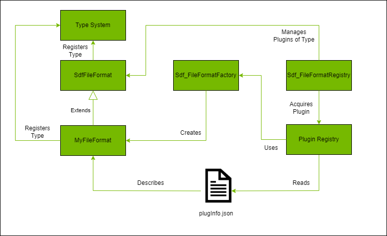

## Introduction

This repository contains a set of samples that illustrate authoring of different kinds of plug-ins for USD.  In particular, this repository contains plug-in samples for:

- USD schemas (both codeful and codeless)
- File Format Plugins
- Dynamic Payloads
- Hydra 2 Scene Indices

Additionally, this repository contains a set of tools that can be used to generate schema code and templates that can be used for both `cmake` and `premake` to build the plug-ins using compiler / linker settings consistent with those used when building USD libraries.  The sections below introduce these samples with the hope of helping you get started on your USD plug-in journey.  Feel free to fork this repository, delete the portions you don't need, and customize the remaining in whatever way suits your USD environment.

While the repository is set up in such a way that you can quickly get started using stock Pixar builds (in this case, `23.05`), the intent is to enable you to "bring your own" USD builds by specifying where it resides in configuration for the included tooling.  Note that not all features included in these samples are available in all USD versions, so some samples may not build out of the box against certain USD versions without modifications.  In general, the schema examples should be compatible with anything `21.02` and later, the dynamic payload example with anything `22.11` and later, and the hydra 2 examples with anything `23.05` and later.

## Quick Start

**Prerequisite: You must have CMake 3.20+ installed on your system and available through the `PATH`**

If you want to directly build and try out the samples in `usdview`, you can use the provided tools to build the libraries and configure the environment to enable you to load the sample scenes in `usdview`.  The commands below assume either a Linux environment or `git-bash` on Windows.


```
./build.bat # builds the release build of the samples into _install\windows-x86_64\release (Windows)
./build.sh  # builds the release build of the samples into _install/linux-x86_64/release (Linux X86)
            # or into _install/linux-aarch64/release (Linux ARM)

source setenvwindows      # sets up a python virtual environment (_venv), installs PySide and PyOpenGL, and sets the PATH / PYTHONPATH
                          # to the built sample libraries and the USD 23.05 distribution, sets the PXR_PLUGINPATH_NAME to include 
                          # paths to the sample plugInfo.json files (Windows)
source setenvlinux        # sets up a python virtual environment (_venv), installs PySide and PyOpenGL, and sets the LD_LIBRARY_PATH / PYTHONPATH
                          # to the built sample libraries and the USD 23.05 distribution, sets the PXR_PLUGINPATH_NAME to include 
                          # paths to the sample plugInfo.json files (Linux)

usdview resources/scene.usda  --unloaded    # opens usdview on the provided sample scene with a dynamic payload in an unloaded state
```

Different samples rely on different sample scenes:

__Dymamic Payloads__

Open `usdview` with the `resources/scene.usda` sample stage.  Once `usdview` has been opened, you can load the dynamic payload by right-clicking on `MetropolitanMuseumOfArt` and selecting `Load`.  Using the default metadata configuration, this will load the payload as a set of deferred reads invoking REST APIs to retrieve department and object data for the Metropolitan Museum of Art.  Alternatively, you can open `usdview` fully loaded without the `--unloaded` option.

__Hydra 2 Metrics Assembler__

Open `usdview` with the `resources/metrics_assembler.usda` sample stage.  You can play with the value of `metersPerUnit` in the `metrics_assembler_2.usda` layer to observe what happens when this value is different from that of the `metersPerUnit` value of the root stage.

__Hydra 2 Warp__

Several examples are provided to illustrate the use of NVIDIA's warp in conjunction with scene indices:

- `warp_demo_mesh.usda` - Sample for using warp to deform a mesh
- `warp_demo_sim.usda` - Sample demonstrating the use of warp to simulate physics against a set of sphere particles

## Licensing Notes

The content herein is subject to the license [here](LICENSE).  The dynamic payload example makes use of the Metropolitan Museum of Art Collection API, and usage of this is subject to terms and conditions specified [here](https://metmuseum.github.io).  In particular, because the API does not require registration or use of an API key, request rates should be limited to _80 requests per second_.

## General Project Structure

The repository is structured as follows:

```
deps
src
  hydra-plugins
    omniGeoSceneIndex
    omniMetricsAssembler
    omniWarpSceneIndex
  kit-extension
  usd-plugins
    dynamicPayload
    fileFormat
    schema
tools
bootstrap.py
build.bat
build.sh
repo.toml
setenvwindows
setenvlinux
setenvwindows.bat
```

All example source code is kept in the `src` diretory, with each sub folder demonstrating a different type of USD plug-in.  The remaining files are there to support the schema generation and build infrastructure necessary to create the plug-in libraries.  This infrastructure uses an NVIDIA tool called `packman` to pull packages required for schema and makefile generation.  These include the following:

- Stock OpenUSD 23.05 builds
- A python distribution used to build the above USD packages (Python 3.10)
- A tool (`repo_usd`) used to generate schema code and makefiles in the desired format (`cmake` / `premake`)
- The jinja python package (3.1.2) and its dependencies to support `usdGenSchema` (installed to a local folder via `repo_usd`)
- The installation of PyOpenGL, PySide, and warp-lang to a virtual environment to support running the provided examples easily

By convention, all folders starting with `_` are derived artifacts and can be safely deleted when cleaning the repository.  In particular, four of these folders are used:

- _repo (stores the download `repo_usd` package for use)
- _build (default location for generated and intermediary build artifacts)
- _install (default location for built and staged plug-ins)
- _venv (a virtual environment created to setup the environment for trying the samples out in `usdview`)

These folders are used or not depending on various configuration options you provide to the `repo_usd` tool via the `repo.toml` file.  Options that can be provided, as well as command line options that can be passed to the `build.bat` / `build.sh` scripts are described in the section `Tool Options` below.

Each set of samples is accompanied by a `README` containing additional information about the relevant part of USD being explored and how the sample is constructed.  These can be found here:

- [Schemas, File Format Plugins, and Dynamic Payloads](src/usd-plugins/README.md)
- [Hydra 2 Scene Indices](src/hydra-plugins/README.md)

The remainder of this document explores the USD plugin system in general and the tooling provided to build the samples in greater depth.

## USD Plugins

USD provides many different extensibility points to allow additional data to be represented, loaded, and worked with as prims and attributes within the USD runtime.  These extensiblity points are implemented via _plugins_, which provide definition of additional data (schemas) and certain runtime behaviors (data loading and asset resolution).  Plugins are implemented via libraries that contain classes that implement base APIs provided by USD to interact with the USD runtime and declared to USD via information contained in a `plugInfo.json` file.

In general, the plugin system of USD works in the same way regardless of plugin type.  USD needs a few things for the plugin system to work:

- An abstract base class declaring the API for the plugin type that is registered with the type system
- A factory function for creating new instances
- A mechanism for loading the plugin into the system

For example, in the case of implementing a custom file format extension, USD provides:

- An abstract base class via `SdfFileFormat`
- A factory object reponsible for creating instances of the plugin type via `Sdf_FileFormatFactory`
- An object that reads information of plugins that implement `SdfFileFormat` and loads them into the runtime via `Sdf_FileFormatRegistry`

This can be illustrated in the diagram below:


To implement a plugin, a developer needs to do a few things:

- Create a class that implements the API of the abstract base class
- Register the type with `Tf`
- Declare the plugin and the information contained therein in a `plugInfo.json` file
- Register the plug-in with the system (either implicitly by specifying a path to the `plugInfo.json` file in `PXR_PLUGINPATH_NAME` or explicitly via a `RegisterPlugins` call in controlling code)

From the point of view of the USD runtime, plugins are read generically by interpreting the `plugInfo.json` file and deriving information about the plugin that can be used to load the plugin into the runtime when requested.  This is the responsibility of the `plug` USD library.  The metadata of all plugins (regardless of type) is held in the `PlugRegistry` object.  On USD runtime startup, the information in all `plugInfo.json` files accessible from paths declared in `PXR_PLUGINPATH_NAME` are loaded, interpreted, and stored in the `PlugRegistry` singleton instance.  Additionally, any `plugInfo.json` files that are found via a `RegisterPlugins` call on the singleton are loaded, interpreted, and stored (more on this later, because order of operations are important!).  The metadata of each plugin is represented by a `PlugPlugin` instance.

Objects that are interested in plugins of a certain type may query the `PlugRegistry` for all plugins that derive from a type registered in the type system via a call to `GetAllDerivedTypes`.  This returns all registered types that derive from the requested type; from this the object can get the actual plugin metadata via a call to `GetPluginForType`.  Finally, the object can load the plugin from the metadata via `Load` in order to work with the specific API implemented by the plugin.  This loads the library associated with the plugin into memory and makes the types in it accessible to the system.  In general, the objects that manage this information are specific for a particular plugin type (e.g. `SdfFileFormat`) and are typically singletons in the USD runtime (e.g., `Sdf_FileFormatRegistry`).  

The file format objects that implement the USD plugin architecture for `SdfFileFormat` are given below:



In all cases, the singleton objects that load plugins do so __once__ at the time of first access and cache that information.  __This means that any code that performs a call to `RegisterPlugins` must be executed prior to the first call to the singleton object managing plugins of that type!__.

For illustrative purposes, the `edf` file format plugin contained within this sample also has an example of a type that manages plugins (of type `IEdfDataProvider`) in a similar way that the built-in USD managers manage their own plugin types.

## Using the Tool to Generate Schema Code and Build Files

These samples use a tool called `repo_usd` to generate the schema code and plug-in information that will be built and distributed.  This is a small wrapper around `usdGenSchema`, provided with a USD build, with several options that control where the information is generated and optionally if build files (e.g., cmake or premake files) should be generated to support build of the schema libraries.  All options are defined in a `toml` file called `repo.toml` at the root of the repository.

A `toml` file is just a set key / value pairs.  Related settings are grouped by heading keys defined in the `[]` pair and individual options are defined using `x=y` notation.  Underneath, these turn into dictionaries that are processed by the `repo_usd` tool to interpret the options into a set of generation instructions that process your USD plugins to generate source code and build files.  These options include:

- General configuration options that apply across all plugins
- Configuration options specific to an individual plugin of all types (including schema types)
- Configuration options specific to an individual schema type plugin

### General Setup

Different organizations may be working with different versions of USD at any given time.  Plugins, however, must be built separately for each individual USD distribution that you want to work with.  As such, first we must tell `repo_usd` where the USD dependencies are so that it knows where to find the include / lib files required for build file generation, and well as where to find `usdGenSchema` for generating code from schema definition files.  `repo_usd` needs two locations to function properly:

- The path to the USD build that will be used (referred to as `usd_root`)
- The path to a Python environment consistent with that which built the referenced USD libraries (referred to as `usd_python_root`)

For example, when building against NVIDIA's USD libraries pulled by `packman`, the `repo.toml` file might be configured as follows:

```
[repo_usd]
usd_root = "${root}/_build/usd-deps/nv-usd/%{config}"
usd_python_root = "${root}/_build/usd-deps/python"
```

A couple of things to note here:

- `${root}` is a special token that `repo_usd` will replace with the path to the root of the repository.  Several paths declared in `repo.toml` must be declared relative to `${root}`.  These include:
    - The path to the USD installation (`usd_root`)
    - The path to the Python installation (`usd_python_root`)
    - The path to a schema file for a schema plugin (`schema_file`)
    - The path to the root of a plugin (`plugin_dir`)
    - The path to the directory to generate code / build files into for a plugin (`generate_dir`)
    - The path to the root directory on which the built artifacts will be deployed for a plugin (`install_root`)
- The paths here reference the `linkPath` property that is defined in the `packman` deps file you have configured to pull the appropriate USD and python packages.  When `packman` pulls these packages down, it will place them in these locations.
- To change the USD build you are referencing, simply change the path specified here (relative to `${root}`).  Make sure that the python environment you use is consistent with that which was used to build the USD libraries being referenced (e.g. if you built USD with Python 3.10, make sure your `usd_python_root` points to an environment containing Python 3.10).

The use of `packman` has been enabled in this repository to pull the relevant USD and python packages (22.11 and 3.10 respectively) for a turnkey type solution that builds plugins compatible with NVIDIA Omniverse (105+).  If you want to use a different version of USD simply change the paths that are specified in `usd_root` and `usd_python_root`.  

By default, `repo_usd` will attempt to detect the USD library prefix for your build dynamically.  This works in most situations, but if it is unable to detect it, you may specify the prefix explicitly in configuration via the `usd_lib_prefix` attribute.  For example, if your USD libraries were of the form lib_arch, lib_tf, etc., you would specify the prefix as follows:

```
[repo_usd]
usd_root = "${root}/_build/usd-deps/nv-usd/%{config}"
usd_python_root = "${root}/_build/usd-deps/python"
usd_lib_prefix = "lib_"
```

`repo_usd` can also generate build files in either `cmake` or `premake` format (`cmake` is the default).  If you would like to take advantage of this functionality, there are a few more options in the `repo.toml` file that are required:

- The build file format you would like to generate (the default is `cmake` and need not be specified unless you want to change it)
- Whether or not you would like to generate the _root_ build files.  By default, this option is `false` (see below for further explanation)

These options can be set in the `repo.toml` file as follows:

```
[repo_usd]
usd_root = "${root}/_build/usd-deps/nv-usd/%{config}"
usd_python_root = "${root}/_build/usd-deps/python"
generate_plugin_buildfiles = true
```

To use `premake`, add the `plugin_buildfile_format` option:

```
[repo_usd]
usd_root = "${root}/_build/usd-deps/nv-usd/%{config}"
usd_python_root = "${root}/_build/usd-deps/python"
generate_plugin_buildfiles = true
plugin_buildfile_format = "premake"
```

When the `generate_plugin_buildfiles` option is on, a build file in the specified format will be generated for each configured plugin to the following locations:

- the configured `generate_dir` for the plugin (or `plugin_dir` if no separate `generate_dir` is specified)

The remainder of this section assumes that the build file format will be the default (`cmake`).  When additional options are required for `premake` this will be noted specifically.

### A Note on Tokens in `repo.toml`

Paths declared in `repo.toml` may include _tokens_ - strings that will be replaced based on the current value of something in the build process.  In most cases, you will want to take advantage of tokens that represent the `platform` the build is occurring on and the `config` being built.  The presence of these tokens is a generic way to specify cross-platform / cross-configuration paths that can be evaluated either at `repo_usd` load time or at build time.  `repo_usd` supports two types of token strings:

- Tokens that are prefixed with the `$` character (e.g., `${platform}`, `${config}`)
- Tokens that are prefixed with the `%` character (e.g., `%{platform}`, `%{config}`)

The first type of tokens are evaluated when the `repo.toml` configuration is loaded by `repo.usd`.  The second type of tokens are used to inform `repo_usd` to emit paths that are generic for the target build system.  For example, `%{config}` will be replaced by `%{cfg.buildcfg}` for `premake` and `PXR_PLUGIN_CONFIGURATION` for `cmake`.  These tokens are then evaluated by the build system at build time depending on your build configuration.  Using tokens generically allows a single `premake5.lua` or `CMakeLists.txt` file to be emitted that can be used on multiple platforms with multiple configurations (i.e., this allows you to generate these files once and commit them to your source control system, if desired).

In addition, the special token `${root}` is used to generically designate the root directory of the repository.  The use of the above tokens (`%` / `$`) are restricted to paths that are based on `${root}`.  That is, paths like `include_dir`, which are specified relative to `install_root`, do not support the use of these tokens.

### Specifying Plugin Specific Options

Each USD plugin in the repository can be configured with a number of options.  All plugins are configured in the `repo.toml` file in the form `repo_usd.plugin.x` where `x` defines the name of the plugin (and from which the compiled library name will derive).  All plugins must specify a path in the `plugin_dir` option, which informs the tool what the plugin's source code root directory will be from which all source files will be referenced.  For example, assume we had a plugin named `myFileFormat`.  We could configure it as follows:

```
[repo_usd]
usd_root = "${root}/_build/usd-deps/nv-usd/%{config}"
usd_python_root = "${root}/_build/usd-deps/python"
generate_plugin_buildfiles = true

[repo_usd.plugin.myFileFormat]
plugin_dir = "${root}/src/myFileFormat"
```

Each plugin must also define the USD libraries that it is dependent on.  Specifying the USD library dependencies is required for all USD plugins, and each may depend upon a different set.  It is also necessary when defining codeful schemas, whether you wish to generate build files for the schema plugin or not (see below).  These are the base names of the USD libraries (e.g. `arch`, `tf`, etc.).  These are defined in the `usd_lib_dependencies` option:

```
[repo_usd]
usd_root = "${root}/_build/usd-deps/nv-usd/%{config}"
usd_python_root = "${root}/_build/usd-deps/python"
generate_plugin_buildfiles = true

[repo_usd.plugin.myFileFormat]
plugin_dir = "${root}/src/myFileFormat"
usd_lib_dependencies = [
    "arch",
    "tf",
    "vt",
    "sdf",
    "usd"
]
```

Plugins may specify a separate `generate_dir` path (relative to `${root}`).  If specified, this is the directory all generated files will be output to (including schema code and build files).  If not specified, `repo_usd` will use `plugin_dir` as the directory.

`repo_usd` exposes a number of options that allow you to control the target directory structure for your plugin.  These include:

- `install_root`: path at which to root the plugin output files (default = `"${root}/_install/${platform}/${plugin_name}`).  This must be specified relative to `${root}`
- `include_dir`: path relative to `install_root` where public headers for the plugin will be copied
- `lib_dir`: path relative to `install_root` where the plugin C++ library will be built to
- `resources_dir`: path relative to `install_root` where resource files (such as `plugInfo.json`, `generatedSchema.usda`, etc.) will be copied

You can change any of these options per-plugin by specifying values for each of the above keys in the `repo.toml` file section of the specific plugin.  In particular, many choose to specify `install_root` explicitly and leave the others as their defaults relative to this path.

When the option `generate_plugin_buildfiles` is on, each plugin is required to specify the files that will be used to build the library the build file will be generated for.  This requires at minimum the following options to be defined (all paths relative to `generate_dir`, which defaults to `plugin_dir` if not specified explicitly):

- `public_headers`: a list of paths that denote the header files that should be included in the generated project and which should also be copied to the specified `include_dir` during the build step.
- `private_headers` a list of paths that denote header files that should be included in the generated project but which should _not_ be copied to `include_dir`.
- `cpp_files`: a list of paths that denote cpp files that should be included in the generated project that contribute source for the library that will be built.
- `resource_files`: a list of paths that denote files that should be included as resources that will be copied to the specified `resources_dir` during the build step.  At minimum, this typically includes the `plugInfo.json` file for your plugin.

If your plugin also requires a Python module to be built, an additional set of options must be provided (all paths relative to `generate_dir`, which defaults to `plugin_dir` if not specified explicitly):

- `module_dir`: Path relative to `install_root` where the Python library will be built to and python module files copied
- `pymodule_cpp_files`: A list of C++ file paths that will be compiled into the Python module library
- `pymodule_files`: A list of python files to include in the Python module distribution.  These files will be copied to the target `module_dir` with relative paths retained.

Note that in the case of schemas (see below), the generated files will be automatically added to the appropriate list above to be included in the respective C++ or Python libraries.

When using `premake`, you may also specify the directory to which the output of the `premake` files are generated.

- `build_dir`: path relative to the repository root where you would like the projects created by premake to be generated.  The premake file itself (`premake5.lua`) is generated to the same directory as the source (`generate_dir` or `plugin_dir` if `generate_dir` is not explicitly specified), but the artifacts of the premake file will be generated to this location.  By default, this location is `${root}/_build/${schema_name}`.  Note that this option is only valid for `premake` - CMake artifacts are generated in the directory specified when running CMake configure and mirrors the source tree.

Finally, additional configuration options are provided for you to specify include and library directories that are additional to the built-in USD and python ones derived from your `usd_root` and `usd_python_root` settings.  As part of this, additional libraries may be specified that the target build will be linked to.  Custom preprocessor definitions (in addition to those already added for USD plugin libraries) can also be added to each plugin.  These are specified via the following options:

- `additional_include_dirs`: A list of additional directories that should be used to find include files the plugin may depend on
- `additional_library_dirs`: A list of additional directories that should be used to find library files the plugin may depend on
- `additional_libs`: A list of additional libs that need to be linked to the plugin to build
- `additional_static_libs`: A list of additional libs that need to be statically linked to the plugin to build
- `preprocessor_defines`: A list of preprocessor definitions to add to the project buildfile

All paths above should be specified relative to the `generate_dir` of the plugin (or `plugin_dir` if `generate_dir` is not specified).

Finally, you can customize dependencies among plug-ins by using the `depends_on` option:

- `depends_on`: A list of strings, each which refers to the name of a plugin that must be built prior to the one this option is attached to.  The string used here is the same string you use in your definition of the root key (i.e., the `x` in `[repo_usd.plugin.x]`)

The above options are valid for all types of plugins.  For plugins that also contain schema definitions, an additional set of options can be provided as discussed below.

### Additional Options for Plugins that Contain Schemas

A schema definition file can be contained within a plugin, indicating that schema definitions and associated code (if not codeless) will be included in the resulting C++ and Python libraries.  Codeful schemas require code to be generated via the `usdGenSchema` tool that comes with the USD distribution and built into a library like any other USD plugin.  Codeless schemas also require `usdGenSchema`, but only resource files are generated (`plugInfo.json` and `generatedSchema.usda`).  The content of the latter file is used by the `UsdSchemaRegistry` to identify your schema types.  

`repo_usd` provides some additional options to configure code and build file generation of schema content in the `[repo_usd.plugin.x]` section:

- `schema_file`: The path to the `schema.usda` file defining the schema classes.  This must be specified relative to `${root}`.
- `library_prefix`: The library prefix that is set in the `schema.usda` file (necessary for generating the python wrapper code, only necessary for codeful schemas)
- `is_codeless`: Whether or not the schema is codeless (by default, the schema is codeful, so this is only necessary if you have a codeless schema).  If the schema is codeless, specifying `usd_lib_dependencies` is not required.

Note that the `library_prefix` option here is different from the `usd_lib_prefix` option defined above.  While the latter defines the prefix on the base USD library name (if you are working with a distribution that has a prefix), the former refers to the value of the `libraryPrefix` field of your `schema.usda` file.  You must ensure that the value of `library_prefix` in the `repo.toml` file matches the value of `libraryPrefix` in your `schema.usda` file.

Also note that defining the `usd_lib_dependencies` is required for codeful schemas, even if the `generate_plugin_buildfiles` option is `false`.  This is because one of the files that is generated (`moduleDeps.cpp`) requires this information to correctly declare the dependencies in code.

Since schema definitions can vary between USD versions (particularly v20.08 and v21.02+), ensure that your `schema.usda` file has a definition that is consistent with that expected by the USD version you are using to generate the code and build files.

A sample configuration for a codeless schema using these options is given below.

```
[repo_usd]
usd_root = "${root}/_build/usd-deps/nv-usd/%{config}"
usd_python_root = "${root}/_build/usd-deps/python"
generate_plugin_buildfiles = true

[repo_usd.plugin.mySchema]
schema_file = "${root}/src/schema/mySchema/schema.usda"
generate_dir = "${root}/src/schema/mySchema/generated"
is_codeless = true
```

Typical configuration of a plugin will define `install_root`, `include_dir`, `lib_dir`, `resource_dir`, and `module_dir` (in the case of schemas) rather than leaving them to the defaults.  For example:

```
[repo_usd]
usd_root = "${root}/_build/usd-deps/nv-usd/%{config}"
usd_python_root = "${root}/_build/usd-deps/python"
generate_plugin_buildfiles = true
plugin_buildfile_format = "premake"

[repo_usd.schema.mySchema]
schema_file = "${root}/src/schema/mySchema/schema.usda"
generate_dir = "${root}/src/schema/mySchema/generated"
library_prefix = "MySchema"
install_root = "${root}/_install/%{platform}/%{config}/mySchema"
include_dir = "include/mySchema"
lib_dir = "bin"
resource_dir = "resources"
module_dir = "MySchema"
usd_lib_dependencies = [
    "arch",
    "tf",
    "vt",
    "sdf",
    "usd"
]
```

Note that schema configurations only need to include `public_headers`, `cpp_files`, `pymodule_cpp_files`, `pymodule_files`, and `resource_files` if there are files to be included that are in addition to those that `usdGenSchema` generates.

`usdGenSchema` will generate most of the code necessary for your schema plugin.  `repo_usd` generates three additional files that in most cases are boilerplate that allow the schema module to be properly loaded by USD:

- `module.cpp`: Defines the `TF_WRAP` statements required to expose the C++ schema classes to Python via `boost::python`
- `moduleDeps.cpp`: Defines the module loader code for the USD `Tf` library
- `__init__.py`: Defines the entry point to the schema Python module and invokes the right loader sequence in the USD `Tf` module

In almost all cases this code is boilerplate and as such generation of these files is on by default.  In some cases, you may need to customize the content of one or more of these files.  `repo_usd` allows you to optionally turn off automatic generation of each of these files through three additional options:

- `generate_module_cpp_file`: Boolean informing `repo_usd` whether or not to generate the `module.cpp` file for the schema plugin (default = `true`)
- `generate_module_deps_cpp_file`: Boolean informing `repo_usd` whether or not to generate the `moduleDeps.cpp` file for the schema plugin (default = `true`)
- `generate_init_py_file`: Boolean informing `repo_usd` whether or not to generate the `__init__.py` file for the schema plugin (default = `true`)

If you set these options to `false`, make sure you have the right content in those files such that USD will load your schema.

The options above are enough to generate schema code and (optionally) build files.  Even if your schema is codeless, build files will be generated in order to configure the `plugInfo.json` file and get the resources (`plugInfo.json` and `generatedSchema.usda`) in the right target directory.  Once the code and build files have been generated, it is up to the user to build the files using their chosen build system (e.g., `cmake`, `premake`, `repo_build` for NVIDIA-projects, etc.).  After everything has been built, a second run of `repo_usd` is required to get the `plugInfo.json` file configured properly in the target directory.  The next section describes this process.

### Configuring the plugInfo.json File

USD plugins are loaded into the USD runtime via the `plugInfo.json` file and a call to `RegisterPlugins` somewhere in the responsible loading code.  The `plugInfo.json` file has three properties (in addition to other definitions) that help USD root the plugin and find the library containing its functionality:

- `LibraryPath`: the path relative to the root of the plugin where USD can find the native library containing the plugin's implementation
- `ResourcePath`: the path relative to the root of the plugin where USD can find the resources (including the `plugInfo.json` file itself) associated with the plugin
- `Root`: The path that is the root path of the plugin (relative to the `plugInfo.json` file) where the other two paths above are rooted from

When `usdGenSchema` generates the code for a schema, it also generates the `plugInfo.json` file, but this file contains three placeholder tokens that must be replaced with real values before your plugin can be distributed.  The replacement of these placeholder tokens with the proper paths is done as part of the _Configure_ step.

In all cases, this must be done as a separate step after the library has been built using your build tools.  Thus, typical generation workflows that involve schemas work in three steps:

1. Run `repo_usd` to generate schema code and build files associated with plugins and schemas
2. Run your build tools to build the plugin libraries
3. Run `repo_usd` again with the `--configure-pluginfo` option to properly configure the `plugInfo.json` file

To perform this configuration, `repo_usd` uses the values you provided (or the defaults if not provided) in the `lib_dir` and `resources_dir` paths defined in the `repo.toml` file.  This means that whatever structure you create at this time is represented in the `plugInfo.json` file, and any subsequent modification of this directory structure will typically make the paths configured in the `plugInfo.json` file incorrect.  Thus, after you run the configure step, your target directory structure is what is used for the plugin configuration - if you use the plugin subsequently somewhere else (e.g. a kit extension), make sure the directory structure is copied to your extension directory __without modification__ such that the information in the `plugInfo.json` file is correct.  Use the `install_root`, `lib_dir`, `include_dir`, `module_dir`, and `resources_dir` options to configure the directory structure how you need it to be for your extension.

The snippet below shows how to run `repo_usd` with the `--configure-pluginfo` option.

```
call "%~dp0tools\packman\python.bat" bootstrap.py usd --configure-pluginfo (Windows)
tools/packman/python.sh bootstrap.py usd --configure-pluginfo (Linux)
```

### Root Build Files

If the `generate_root_buildfiles` option is on, `repo_usd` will also generate a root `CMakeLists.txt` / `premake5.lua` file at the root of the repository that integrates the individual ones generated for each plugin.  This is provided as a convenience for getting started, but is often insufficient for integration into an existing build process.  As such, you may choose to generate this file once, and then turn this generation off and customize the generated file to your liking.  While this turnkey type setup can be useful, you may also choose to write the main build files yourself and integrate those generated for each plugin in a way that best suits your own build infrastructure.  If you choose to do this, you must include certain macros provided by `repo_usd` that set compiler and linker switches, take care of copying public headers and resource files, etc.  Interested parties can examine these files in `_repo/repo_usd/templates`.  At a minimum, your root `CMakeLists.txt` file must have the following content (for the two example plugins used above):

```
# repo_usd requires CMAKE 3.20 minmum, but yours may be higher
# cmake_minimum_required(VERSION 3.20)

# create a projet e.g.:
# project(usd-plugins)

# include the cmake file required for declaring a plugin
set(CMAKE_MODULE_PATH ${CMAKE_MODULE_PATH} _repo/repo_usd/templates/cmake)
include(PxrPlugin)

# add each plugin subdirectory to the list
add_subdirectory(src/plugins/myFileFormat)
add_subdirectory(src/schema/mySchema/generated)
```

Similarly, for `premake`, your root `premake5.lua` file must have the following:

```
require("_repo/repo_usd/templates/premake/premake5-usdplugin")

-- declare a workspace or use your existing one e.g.:
-- workspace(usd-plugins)

-- make sure these definitions are in the context of a workspace
-- they do not declare their own
require("src/plugins/myFileFormat/premake5")
require("src/schema/mySchema/generated/premake5")
```

__NOTE: If you have the option `generate_root_buildfile` on please ensure that you do not have a CMakeLists.txt or premake5.lua file already at your repository root or setting this option will overwrite it!__

The samples provided in this repository have this option turned off (the default) because a properly configured root build file already exists.

### What if I Want to Place the Generated Files Under Source Control?

If your schema definitions do not change often, you may choose to not run `repo_usd` with every build.  In this case, `repo_usd` is run once (both steps, generate and configure) and the files are generated.  If you choose to place the files in the `generate_dir` under source control, ensure that the `plugInfo.json` you place in source control is the one that was configured after the configure step and not the one prior (otherwise it will have the placeholder information generated by `usdGenSchema`).  This likely means as part of your one-time run of `repo_usd` you will also need a copy step to copy the configured `plugInfo.json` file back into the `generate_dir` location to overwrite the template with the correct values.

### Reference: Valid keys for `repo_usd` and the `repo.toml` File

The following keys are available to configure `repo_usd`.

`[repo_usd]`:
- `usd_root`: (**Required** *string*) Specifies the path to the built USD installation on disk
- `usd_python_root`: (**Required** *string*) Specifies the path to a Python installation on disk compatible with that used to build USD
- `generate_plugin_buildfiles`: (**Optional** *bool* *default=false*) True to generate `CMakeLists.txt` / `premake5.lua` files
- `plugin_buildfile_format`: (**Optional** *string* *default=cmake*) `cmake` to generate `CMakeLists.txt` files, `premake` for `premake5.lua` files
- `generate_root_buildfile`: (**Optional** *bool* *default=false*) True to generate a `CMakeLists.txt` file at the root of the repository that includes the individual plugin `CMakeLists.txt` files (or `premake5.lua` file if `plugin_buildfile_format` is `premake`)
- `usd_lib_prefix`: (**Optional** *string* *default=""*) A string denoting any prefix that needs to be added to the USD library dependencies based on your USD installation
 
`[repo_usd.plugin.x]`:
- `plugin_dir`: (**Required** *string*) Path relative to `${root}` where the source code of the plugin resides
- `generate_dir`: (**Optional** *string* *default=plugin_dir*) Path relative to `${root}` where the build files (for all plugins) and schema files (for schemas) will be generated to
- `install_root`: (**Optional** *string* *default="${root}/_install/${platform}/x"*) Path relative to `${root}` where the built artifacts will be placed for the plugin
- `include_dir`: (**Optional** *string* *default="include"*) Path relative to `install_root` where `public_headers` will be placed
- `lib_dir`: (**Optional** *string* *default="lib"*) Path relative to `install_root` where the built C++ library will be placed
- `resources_dir`: (**Optional** *string* *default="resources") Path relative to `install_root` where all `resource_files` will be copied to and where `plugInfo.json` will be configured from
- `usd_lib_dependencies`: (**Required** *list of strings*, unless this configuration is for a codeless schema in which case it is not required) List of base USD library names (e.g., `arch`, `tf`, etc.) on which the plugin depends
- `public_headers`: (**Optional** *list of strings* *default=[]*) List of header files relative to `plugin_dir` that will be copied to the `include_dir` target
- `private_headers`: (**Optional** *list of strings* *default=[]*) List of header files relative to `plugin_dir` that are required for compilation but that will not be copied to the `include_dir` target
- `cpp_files`: (**Optional** *list of strings* *default=[]*) List of C++ files relative to `plugin_dir` that are required for compilation
- `resource_files`: (**Optional** *list of strings* *default=[]*) List of additional files relative to `plugin_dir` that will be copied to the `resources_dir` target (e.g., `plugInfo.json`)
- `additional_include_dirs`: (**Optional** *list of strings* *default=[]*) List of additional include directories relative to `plugin_dir` that will be added to the build file
- `additional_library_dirs`: (**Optional** *list of strings* *default=[]*) List of additional library directories relative to `plugin_dir` that will be added to the build file
- `additional_libs`: (**Optional** *list of strings* *default=[]*) List of additional libraries needed for compilation that will be added to the build file
- `preprocessor_defines`: (**Optional** *list of strings* *default=[]*) List of preprocessor definitions to add to the build file (Note: the build system will automatically add `x_EXPORTS` and the relevant preprocessor defines for `boost` and `tbb` for USD)
- `depends_on`: (**Optional** *list of strings* *default=[]*) List of plugins this one depends on so the build files generated have the right ordering
- `schema_file`: (**Required** *string*) Path relative to `${root}` where the `schema.usda` file can be found (including the `schema.usda` part)
- `is_codeless`: (**Optional** *bool* *default=false*) True if the schema should be a codeless schema, false otherwise
- `module_dir`: (**Optional** *string* *default="x"*) Path relative to `install_root` where the built Python module and Python module files will be placed
- `pymodule_cpp_files`: (**Optional** *list of strings* *default=[]*) List of C++ files relative to `plugin_dir` that are required for compiling the Python module
- `pymodule_files`: (**Optional** *list of strings* *default=["generate_dir/__init__.py"]*) List of Python files relative to `plugin_dir` that will be copied to the `resources_dir` target (preserving sub-directory structure)
- `generate_module_cpp_file`: (**Optional** *bool* *default=true*) Boolean informing `repo_usd` whether or not to generate the `module.cpp` file for the schema plugin
- `generate_module_deps_cpp_file`: (**Optional** *bool* *default=true*) Boolean informing `repo_usd` whether or not to generate the `moduleDeps.cpp` file for the schema plugin
- `generate_init_py_file`: (**Optional** *bool* *default=true*) Boolean informing `repo_usd` whether or not to generate the `__init__.py` file for the schema plugin
- `generate_buildfile`: (**Optional** *bool* *default=`generate_plugin_buildfiles`) Boolean informing `repo_usd` to override whatever setting is in `generate_plugin_buildfiles` globally on a per-plugin basis.

## Contributing

The source code for this repository is provided as-is and we are not accepting outside contributions at this time.
