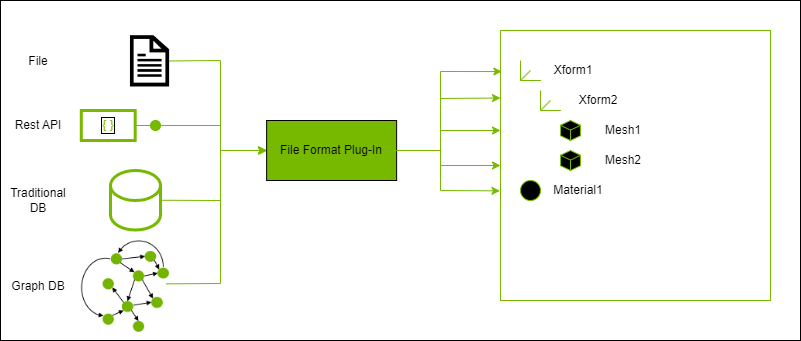

## Introduction

This repository contains a set of samples that illustrate authoring of different kinds of plug-ins for USD.  In particular, this repository contains plug-in samples for:

- USD schemas (both codeful and codeless)
- File Format Plugins
- Dynamic Payloads

Additionally, this repository contains a set of tools that can be used to generate schema code and templates that can be used for both CMake and Premake to build the plug-ins using compiler / linker settings consistent with those used when building USD libraries.  The sections below introduce these samples with the hope of helping you get started on your USD plug-in journey.  Feel free to fork this repository, delete the portions you don't need, and customize the remaining in whatever way suits your USD environment.

## Quick Start

If you want to directly build and try out the dynamic payload sample in `usdview`, you can build the samples and set the environment using the sample tools, and load the payload in `usdview`.  The commands below assume either a Linux environment or `git-bash` on Windows.

```
./build.bat         # builds the release build of the samples into _install\${platform}\release (Windows)
./build.sh          # builds the release build of the samples into _install/${platform}/releaes (Linux)

source setenvwindows      # sets up a python virtual environment (_dpvenv), installs PySide and PyOpenGL, and sets the PATH / PYTHONPATH
                          # to the built sample libraries and NVIDIA USD 22.11 distribution, sets the PXR_PLUGINPATH_NAME to include 
                          # paths to the sample plugInfo.json files (Windows)
source setenvlinux        # sets up a python virtual environment (_dpvenv), installs PySide and PyOpenGL, and sets the LD_LIBRARY_PATH / PYTHONPATH
                          # to the built sample libraries and NVIDIA USD 22.11 distribution, sets the PXR_PLUGINPATH_NAME to include 
                          # paths to the sample plugInfo.json files (Linux)

usdview resources/scene.usda  --unloaded    # opens usdview on the provided sample scene with a dynamic payload in an unloaded state
```

Once `usdview` has been opened, you can load the dynamic payload by right-clicking on `MetropolitanMuseumOfArt` and selecting `Load`.  Using the default metadata configuration, this will load the payload as a set of deferred reads invoking REST APIs to retrieve department and object data for the Metropolitan Museum of Art.  Alternatively, you can open `usdview` fully loaded without the `--unloaded` option.

## General Project Structure

The repository is structured as follows:

```
deps
src
  kit-extension
  usd-plugins
    dynamicPayload
    fileFormat
    schema
tools
bootstrap.py
build.bat
build.sh
repo.toml
setenv
```

All example source code is kept in the `src` diretory, with each sub folder demonstrating a different type of USD plug-in.  The remaining files are there to support the schema generation and build infrastructure necessary to create the plug-in libraries.  This infrastructure uses an NVIDIA tool called `packman` to pull packages required for schema and makefile generation.  These include the following:

- USD 22.11 builds compatible with NVIDIA Omniverse 105 kit-based applications
- A python distribution used to build the above USD packages (Python 3.10)
- A tool (`repo_usd`) used to generate schema code and makefiles in the desired format (Cmake / Premake)
- The jinja python package (3.1.2) and its dependencies to support `usdGenSchema` (installed to a local folder via `repo_usd`)

By convention, all folders starting with `_` are derived artifacts and can be safely deleted when cleaning the repository.  In particular, four of these folders are used:

- _repo (stores the download `repo_usd` package for use)
- _build (default location for generated and intermediary build artifacts)
- _install (default location for built and staged plug-ins)
- _dpenv (a virtual environment created to test the dynamic payload samples out in `usdview`)

These folders are used or not depending on various configuration options you provide to the `repo_usd` tool via the `repo.toml` file.  Options that can be provided, as well as command line options that can be passed to the `build.bat` / `build.sh` scripts are described in the section `Tool Options` below.

## USD Plugins

USD provides many different extensibility points to allow additional data to be represented, loaded, and worked with as prims and attributes within the USD runtime.  These extensiblity points are implemented via _plugins_, which provide definition of additional data (schemas) and certain runtime behaviors (data loading and asset resolution).  Plugins are implemented via libraries that contain classes that implement base APIs provided by USD to interact with the USD runtime and declared to USD via information contained in a `plugInfo.json` file.

In general, the plugin system of USD works in the same way regardless of plugin type.  USD needs a few things for the plugin system to work:

- An abstract base class declaring the API for the plugin type that is registered with the type system
- A factory function for creating new instances
- A mechanism for loading the plugin into the system

For example, in the case of implementing a custom file format extension, USD provides:

- An abstract base class via `SdfFileFormat`
- A factory object reponsible for creating instances of the plugin type via `Sdf_FileFormatFactory`
- An object that reads information of plugins that implement `SdfFileFormat` and loads them into the runtime via `Sdf_FileFormatRegistry`

This can be illustrated in the diagram below:


To implement a plugin, a developer needs to do a few things:

- Create a class that implements the API of the abstract base class
- Register the type with `Tf`
- Declare the plugin and the information contained therein in a `plugInfo.json` file
- Register the plug-in with the system (either implicitly by specifying a path to the `plugInfo.json` file in `PXR_PLUGINPATH_NAME` or explicitly via a `RegisterPlugins` call in controlling code)

From the point of view of the USD runtime, plugins are read generically by interpreting the `plugInfo.json` file and deriving information about the plugin that can be used to load the plugin into the runtime when requested.  This is the responsibility of the `plug` USD library.  The metadata of all plugins (regardless of type) is held in the `PlugRegistry` object.  On USD runtime startup, the information in all `plugInfo.json` files accessible from paths declared in `PXR_PLUGINPATH_NAME` are loaded, interpreted, and stored in the `PlugRegistry` singleton instance.  Additionally, any `plugInfo.json` files that are found via a `RegisterPlugins` call on the singleton are loaded, interpreted, and stored (more on this later, because order of operations are important!).  The metadata of each plugin is represented by a `PlugPlugin` instance.

Objects that are interested in plugins of a certain type may query the `PlugRegistry` for all plugins that derive from a type registered in the type system via a call to `GetAllDerivedTypes`.  This returns all registered types that derive from the requested type; from this the object can get the actual plugin metadata via a call to `GetPluginForType`.  Finally, the object can load the plugin from the metadata via `Load` in order to work with the specific API implemented by the plugin.  This loads the library associated with the plugin into memory and makes the types in it accessible to the system.  In general, the objects that manage this information are specific for a particular plugin type (e.g. `SdfFileFormat`) and are typically singletons in the USD runtime (e.g., `Sdf_FileFormatRegistry`).  

The file format objects that imlement the USD plugin architecture for `SdfFileFormat` are given below:


In all cases, the singleton objects that load plugins do so __once__ at the time of first access and cache that information.  __This means that any code that performs a call to `RegisterPlugins` must be executed prior to the first call to the singleton object managing plugins of that type!__.

For illustrative purposes, the `edf` file format plugin contained within this sample also has an example of a type that manages plugins (of type `IEdfDataProvider`) in a similar way that the built-in USD managers manage their own plugin types.

## USD Schemas

Recall that USD defines the concept of a "prim".  Prims abstractly serve as data containers for groups of logically related data.  These groups are referred to as _schemas_ (or more specificaly, _prim schemas_ to distinguish them from _property schemas_).  When we say that a prim has a type of _Mesh_, what we really mean is that the prim provides the logical set of related data defined by the `UsdGeomMesh` schema (e.g., vertices, faces, normals, etc.).

Schemas are divided into two major categories _IsA_ schemas and _API_ schemas.  _IsA_ schemas are meant to define a specific purpose for a prim.  In the case above, a _Mesh_ prim is a prim who's specific purpose is to represent a mesh.  A prim can only subscribe to a single _IsA_ schema - that is, it has a single well defined role in the scene hierarchy.  These types of schemas can be inherited and within that inheritance hierarchy schemas can be either _abstract_ or _concrete_.  Only concrete schemas are instantiable in the USD scene hierarchy.

_API Schemas_, on the other hand, serve only as additional data groups on prims as well as a well-defined API to get and set those values.  These schema types can be applied to any prim in the scene hierarchy (as long as the schema rules say it can be applied to that prim type). If a prim has a type, you will see that type in the scene hierarchy.  If a prim has an API schema applied, you won't see a difference in its type, but will still be able to ask that prim for the data contained within that schema.  These types of schemas can be either _non-applied_ or _applied_ API schemas, with the difference being that applied API schemes will be recorded in the USD file such that they retain that information on interchange of the scene data to other applications.  If a schema is an applied API schema, it can be either single instance (_single-apply_ API schemas, applied only once to a prim) or multi-instance (_multiple-apply_ API schemas, can be applied several times, each defining a unique instance).

USD ships with many schema definitions that you may be familiar with, including "IsA" schemas (e.g., `Mesh`, `Xform`) and "API" schemas (e.g., `UsdShadeMaterialBindingAPI`, `UsdCollectionAPI`, etc.).  These can all be found in their respective modules (e.g., the schema set provided by `UsdGeom` can be found in pxr/usd/usdGeom/schema.usda).

More information on schemas can be found here: https://graphics.pixar.com/usd/release/tut_generating_new_schema.html

### Creating new Schema Extensions and Naming Conventions

Schema extensions are created by defining the schema using USD syntax, typically in a file called `schema.usda`.  Before defining your schema classes, you must determine the name of your schema library.  Since the entire USD community can add schema extensions, it is important to be able to recognize from which organization / application a schema extension originates and to name them uniquely enough such that naming collisions do not occur across applications.  For example, across the NVIDIA organization, we want that our schema extensions are easily recognizeable by the community so it is clear what Omniverse will support and what 3rd party applications may not have support for.  In general, you can expect the following:

- `Omni` is be used as the recognizeable prefix used for our schema extensions. If `Omni` is not appropriate, other prefixes may be used as long as they are distinct enough to recognize that they came from NVIDIA (e.g., `PhysX`).
- All applied API schemas will end with the `API` suffix (as well as adhering to the prefix rule above)
- All properties added by an API schema will start with a recognizeable namespacing prefix (e.g., `omni`) and be namespaced appropriately (e.g., `omni:graph:attrname`, etc.)
- Properties within an IsA schema may have namespace prefixes if derived from core USD schema types.

The samples provide examples for two types of schemas, codeful and codeless.  The former will have C++ / Python code generated for it, the latter will only have USD plug-in information generated.  These are provided in the `src/usd-plugins/schema/omniExampleSchema` and `src/usd-plugins/schema/omniExampleCodelessSchema` in their respective `schema.usda` files.  

## File Format Plugins

A _file format plugin_ is one type of plugin to USD that is responsible for dynamically translating the contents of a foreign format into `SdfPrimSpec` compatible data.  While files are common, the source data does not have to reside strictly in a file.  



Two objects are provided in the `Sdf` library for implementing file format plugins, `SdfFileFormat` and `SdfAbstractData`.  The former is a base class for defining a new type of file format and the interface used to read / write that format by the USD runtime and the latter is a data adapter that can be used to customize how the data that was read is stored / cached / accessed.  All file format plugins implement `SdfFileFormat`.  File format plugins that need more granular management of the data cache also implement `SdfAbstractData` although this is not necessary - if you do not provide a custom data object the USD runtime will use `SdfData` as the data object associated with the content from your file format for a layer.

From a USD runtime perspective, file format plugins involve the following objects:


When a stage is opened, the root layer is opened and prim specs are formed for all prims.  Each of these are indexed by the composition engine and the index notes if there are additional composition arcs for a prim (e.g., via a reference or payload).  These payload arcs are resolved by opening the referenced layer.  If the layer is an asset reference to a foreign file format, `Sdf` will look for a plugin responsible for that format and ask an instance of that plugin to load the asset.  This is done by the layer (`SdfLayer`) asking the `Sdf_FileFormatRegistry` to find a plugin associated with a particular extension, which if accessed for the first time triggers an acquisition of all plugins drived from `SdfFileFormat` held by `PlugRegistry` and the loading of the one responsible for the particular extension.  Once found, `SdfLayer` will initialize a `SdfAbstractData` object to associate with the file format (either a custom one provided by the file format or `SdfData` if there is no custom data object) and ask the plugin to read the information into the layer.  For each prim read in the layer, the composition engine will index those prims and recursively resolve any additional composition arcs required to build the full prim index.

File format plugins may also write out content in their native format.  By default, custom file format plugins do not write content and it is up to the implementor to indicate that they support writes and to write the content out appropriately.

Interestingly, file format plugins do not actually have to read from files - they can read from any backing data store as long as they know what data to read and how to interpret it.  From the point of view of the USD runtime, the only requirements are the interface to reading / writing the data and the association of the plugin type to a file extension (which can be made up for non-file types).

This repository provides a sample file format plugin that is used to implement dynamic payload functionality in the `src/fileFormat/edfFileFormat` directory.  The information is read from REST APIs associated with the Metropolitan Museum of Art to illustrate the data need not come from a file at all.  An empty file (`resources/empty.edf`) is provided such that the payload reference can be added to the stage using an existing asset, but the content is not used at all.  We could eliminate the file entirely by referencing an anonymous layer with the `.edf` extension.

Other examples of more traditional file format plugins exist directly in the USD repository; for example, the Alembic (`abc`) file format plugin resides here:

- https://github.com/PixarAnimationStudios/USD/blob/release/pxr/usd/plugin/usdAbc/alembicFileFormat.h

## Dynamic Payloads

_Dynamic payloads_ are file format plugins with additional functionality to make them a bit more dynamic in nature.  These dynamics are provided via a set of parameters in the metadata of the prim that has the payload composition arc to a dynamic payload.  This is a powerful mechanism because:

- The information brought into the layer can be parameterized in ways specific to the data the payload is resposible for
- Those parameters can be modified by tools that allow metadata modification to reload the layer with the new parameter set
- Metadata participates in composition, so the composition engine can form the strongest opinions of the custom prim metadata and use that opinion to compute additional file format arguments that will be added to the asset path (and sent to the file format plugin)

From a USD runtime perspective, dynamic payloads involve the following objects (additionally to those already shown for file format plugins)


To implement a dynamic payload, your file format plugin must provide additional functionality for the USD runtime:

- Must inherit `PcpDynamicFileFormatInterface` in addition to `SdfFileFormat`
- Must be able to compose a set of `FileFormatArguments` from the contents of metadata read from the prim associated with the paylaod

The metadata used must be declared in the `plugInfo.json` file such that `Sdf` knows about it.  It is up to you to determine what format this metadata takes and there is often a balance between generality (for extensiblity) vs. clarity (knowing what exactly can be parameterized).  

The `PcpDynamicFileFormatInterface` provides two important methods that need to be implemented:

- `ComposeFieldsForFileFormatArguments`: This method takes a composition context to acquire the composed metadata and translate this information into a set of `FileFormatArguments` that will be provided to the layer when opening the layer (and eventually, to the `SdfFileFormat` object as arguments to the `Read` invocation)
- `CanFieldChangeAffectFileFormatArguments`: This method allows the file format plugin to inform the composition engine what metadata value changes would contribute to the construction of new file format arguments (and hence, a reload of the layer)

Depending on how the implementation translates the metadata into `FileFormatArguments`, it is possible that there is a 1:1, 1:N, or N:1 mapping of metadata values to `FileFormatArguments` values.  It is up to the implementation to understand whether changes to a particular metadata value would contribute to a recomputation of a `FileFormatArguments` value.  If a change does contribute and new `FileFormatArguments` are generated, the composition engine will trigger a reload of that layer using the new `FileFormatArguments`.  Since the arguments contribute to the layer identifier, this would be considered a new layer from the point of view of the USD runtime.

This repository provides an example of a dynamic payload between two plugins:

- The `EdfFileFormat` object provided in `src/usd-plugins/fileFormat/edfFileFormat`
- The `OmniMetProvider` object provided in `src/usd-plugins/dynamicPayload/omniMetProvider`

This was structured in this way for two reasons:

- To illustrate that one file format could architecturally handle multiple back-ends generically by using its own plugin mechanism for loading back-end providers identified via a type on the metadata
- To illustrate an example of an object that managees its own types of plugins

Architecturally, this breaks down as follows:


Note that the implementation for data provider plugins is modeled exactly after the generic USD plugin architecture.  This pattern allows you to create and manage your own plugins in the same way USD does.  In this case, the file format plugin architecture manages the `EdfFileFormat` plugin itself, and the `EdFFileFormat` takes care of loading whatever provider is specified via the metadata attached to the prim.  In theory, this allows different dynamic payloads on different prims to use different data providers to source data, but uses the same fundamental architecture to manage that data once it comes in.

## Using the Tool to Generate Schema Code and Build Files

These samples use a tool called `repo_usd` to generate the schema code and plug-in information that will be built and distributed.  This is a small wrapper around `usdGenSchema`, provided with a USD build, with several options that control where the information is generated and optionally if build files (e.g., cmake or premake files) should be generated to support build of the schema libraries.  All options are defined in a `toml` file called `repo.toml` at the root of the repository.

A `toml` file is just a set key / value pairs.  Related settings are grouped by heading keys defined in the `[]` pair and individual options are defined using `x=y` notation.  Underneath, these turn into dictionaries that are processed by the `repo_usd` tool to interpret the options into a set of generation instructions that process your USD plugins to generate source code and build files.  These options include:

- General configuration options that apply across all plugins
- Configuration options specific to an individual schema type plugin
- Configuration options specific to an individual plugin of all types (including schema types)

### General Setup

Different organizations may be working with different versions of USD at any given time.  Plugins, however, must be built separately for each individual USD distribution that you want to work with.  As such, first we must tell `repo_usd` where the USD dependencies are so that it knows where to find the include / lib files required for build file generation, and well as where to find `usdGenSchema` for generating code from schema definition files.  `repo_usd` needs three locations to function properly:

- The path to the release USD build that will be used (referred to as `usd_release_root`)
- The path to the debug USD build that will be used (referred to as `usd_debug_root`)
- The path to a Python environment consistent with that which built the referenced USD libraries (referred to as `usd_python_root`)

For example, when building against NVIDIA's USD libraries pulled by `packman`, the `repo.toml` file might be configured as follows:

```
[repo_usd]
usd_release_root = "${root}/_build/usd-deps/nv-usd/release"
usd_debug_root = "${root}/_build/usd-deps/nv-usd/debug"
usd_python_root = "${root}/_build/usd-deps/python"
```

A couple of things to note here:

- `${root}` is a special token that `repo_usd` will replace with the path to the root of the repository.  All paths defined in `repo.toml` should be specified relative to `${root}` unless noted otherwise.
- The paths here reference the `linkPath` property that is defined in the `packman` deps file you have configured to pull the appropriate USD and python packages.  When `packman` pulls these packages down, it will place them in these locations.
- To change the USD build you are referencing, simply change the path specified here (relative to `${root}`).  Make sure that the python environment you use is consistent with that which was used to build the USD libraries being referenced (e.g. if you built USD with Python 3.10, make sure your `usd_python_root` points to an environment containing Python 3.10).

The use of `packman` has been enabled in this repository to pull the relevant USD and python packages (22.11 and 3.10 respectively) for a turnkey type solution that builds plugins compatible with NVIDIA Omniverse (105+).  If you want to use a different version of USD simply change the paths that are specified in `usd_release_root`, `usd_debug_root`, and `usd_python_root`.  

`repo_usd` can also generate build files in either `cmake` or `premake` format (`cmake` is the default).  If you would like to take advantage of this functionality, there are a few more options in the `repo.toml` file that are required:

- The build file format you would like to generate (the default is `cmake` and need not be specified unless you want to change it)
- Whether or not you would like to generate the _root_ build files.  By default, this option is `false` (see below for further explanation)

These options can be set in the `repo.toml` file as follows:

```
[repo_usd]
usd_debug_root = "${root}/_build/usd-deps/nv-usd/debug"
usd_release_root = "${root}/_build/usd-deps/nv-usd/release"
usd_python_root = "${root}/_build/usd-deps/python"
generate_plugin_buildfiles = true
```

To use `premake`, add the `plugin_buildfile_format` option:

```
[repo_usd]
usd_debug_root = "${root}/_build/usd-deps/nv-usd/debug"
usd_release_root = "${root}/_build/usd-deps/nv-usd/release"
usd_python_root = "${root}/_build/usd-deps/python"
generate_plugin_buildfiles = true
plugin_buildfile_format = "premake"
```

When the `generate_plugin_buildfiles` option is on, a build file in the specified format will be generated for each configured plugin to the following locations:

- the configured `plugin_dir` for non-schema plugins
- the configured `generate_dir` for schema plugins

These are required options for each plugin / schema defined and discussed in further detail below.  The remainder of this section assumes that the build file format will be the default (`cmake`).  When additional options are required for `premake` this will be noted specifically.

### Specifying Plugin Specific Options

Each USD plugin in the repository can be configured with a number of options.  All non-schema plugins are configured in the `repo.toml` file in the form `repo_usd.plugin.x` where `x` defines the name of the plugin (and from which the compiled library name will derive).  All plugins must specify a path in the `plugin_dir` option, which informs the tool what the plugin's source code root directory will be from which all source files will be referenced.  For example, assume we had a plugin named `myFileFormat`.  We could configure it as follows:

```
[repo_usd]
usd_debug_root = "${root}/_build/usd-deps/nv-usd/debug"
usd_release_root = "${root}/_build/usd-deps/nv-usd/release"
usd_python_root = "${root}/_build/usd-deps/python"
generate_plugin_buildfiles = true

[repo_usd.plugin.myFileFormat]
plugin_dir = "${root}/src/myFileFormat"
```

Each plugin must also define the USD libraries that it is dependent on.  These are the base names of the USD libraries (e.g. `arch`, `tf`, etc.).  These are defined in the `usd_lib_dependencies` option:

```
[repo_usd]
usd_debug_root = "${root}/_build/usd-deps/nv-usd/debug"
usd_release_root = "${root}/_build/usd-deps/nv-usd/release"
usd_python_root = "${root}/_build/usd-deps/python"
generate_plugin_buildfiles = true

[repo_usd.plugin.myFileFormat]
plugin_dir = "${root}/src/myFileFormat"
usd_lib_dependencies = [
    "arch",
    "tf",
    "vt",
    "sdf",
    "usd"
]
```

If using a USD build with a custom prefix, you may specify this prefix in the `repo_usd` configuration and it will be applied to all USD base names when forming the library dependency.  For example, if your USD libraries were of the form lib_arch, lib_tf, etc., you would specify the prefix as follows:

```
[repo_usd]
usd_debug_root = "${root}/_build/usd-deps/nv-usd/debug"
usd_release_root = "${root}/_build/usd-deps/nv-usd/release"
usd_python_root = "${root}/_build/usd-deps/python"
generate_plugin_buildfiles = true
usd_lib_prefix = "lib_"

[repo_usd.plugin.myFileFormat]
plugin_dir = "${root}/src/myFileFormat"
usd_lib_dependencies = [
    "arch",
    "tf",
    "vt",
    "sdf",
    "usd"
]
```

Specifying the USD library dependencies is required for all USD plugins, and each may depend upon a different set.  It is also necessary when defining codeful schemas, whether you wish to generate build files for the schema plugin or not (see below).

`repo_usd` exposes a number of options that allow you to control the target directory structure for your plugin.  These include:

- `install_root`: path at which to root the plugin output files (default = `"${root}/_install/${platform}/${plugin_name}`)
- `include_dir`: path relative to `install_root` where public headers for the plugin will be copied
- `lib_dir`: path relative to `install_root` where the plugin C++ library will be built to
- `resources_dir`: path relative to `install_root` where resource files (such as `plugInfo.json`, `generatedSchema.usda`, etc.) will be copied

You can change any of these options per-plugin by specifying values for each of the above keys in the `repo.toml` file section of the specific plugin.  In particular, many choose to specify `install_root` explicitly and leave the others as their defaults relative to this path.

When the option `generate_buildfile_format` is on, each plugin is required to specify the files that will be used to build the library the build file will be generated for.  This requires the following options to be defined:

- `public_headers`: a list of paths (relative to `plugin_dir`) that denote the header files that should be included in the generated project and which should also be copied to the specified `include_dir` during the build step.  If using this option for schemas, the paths must be relative to `generate_dir`.
- `private_headers` a list of paths (relative to `plugin_dir`) that denote header files that should be included in the generated project but which should _not_ be copied to `include_dir`.  If using this option for schemas, the paths must be relative to `generate_dir`.
- `cpp_files`: a list of paths (relative to `plugin_dir`) that denote cpp files that should be included in the generated project that contribute source for the library that will be built.  This option is not used for schemas (which instead use `additional_cpp_files`).
- `resource_files`: a list of paths (relative to `plugin_dir` for general plugins, or `generate_dir` for schemas specifically) that denote files that should be included as resources that will be copied to the specified `resources_dir` during the build step.  At minimum, this typically includes the `plugInfo.json` file for your plugin.

When using `premake`, you may also specify the directory to which the output of the `premake` files are generated.

- `build_dir`: path relative to the repository root where you would like the projects created by premake to be generated.  The premake file itself (`premake5.lua`) is generated to the same directory as the source (`plugin_dir` for generic plugins, `generate_dir` for schema plugins), but the artifacts of the premake file will be generated to this location.  By default, this location is `${root}/_build/${schema_name}`.  Note that this option is only valid for `premake` - CMake artifacts are generated in the directory specified when running CMake configure and mirrors the source tree.

Finally, additional configuration options are provided for you to specify include and library directories that are additional to the built-in USD and python ones derived from your `usd_release_root`, `usd_debug_root`, and `usd_python_root` settings.  As part of this, additional libraries may be specified that the target build will be linked to.  Custom preprocessor definitions (in addition to those already added for USD plugin libraries) can also be added to each plugin.  These are specified via the following options:

- `additional_include_dirs`: A list of additional directories that should be used to find include files the plugin may depend on
- `additional_library_dirs`: A list of additional directories that should be used to find library files the plugin may depend on
- `additional_libs`: A list of additional libs that need to be linked to the plugin to build
- `preprocessor_defines`: A list of preprocessor definitions to add to the project buildfile

The above options are valid for all types of plugins, including schema plugins.  The following section denotes the options that are additionally valid only for schema type plugins.

### Configuring Schema Generation

Schemas are special types of plugins because they are defined via schema definition files and can be either codeful or codeless.  Codeful schemas require code to be generated via the `usdGenSchema` tool that comes with the USD distribution and built into a library like any other USD plugin.  Codeless schemas also require `usdGenSchema`, but only resource files are generated (`plugInfo.json` and `generatedSchema.usda`).  The content of the latter file is used by the `UsdSchemaRegistry` to identify your schema types.  

`repo_usd` provides some additional options to configure code and build file generation of schema content.  Like regular plugins, they are defined individually in the `repo.toml` file, but instead of in the section `repo_usd.plugin` they are each defined in the section `repo_usd.schema`.  For example, if you had a schema `mySchema`, you would define its options in a block like the following:

```
[repo_usd]
usd_debug_root = "${root}/_build/usd-deps/nv-usd/debug"
usd_release_root = "${root}/_build/usd-deps/nv-usd/release"
usd_python_root = "${root}/_build/usd-deps/python"
generate_plugin_buildfiles = true

[repo_usd.schema.mySchema]
```

All options that are valid for plugins are also valid for schemas.  But schemas have a few additional options that are explored in this section.  Each schema at minimum requires definition of the following options:

- `schema_file`: The path to the `schema.usda` file defining the schema classes
- `generate_dir`: The path to a directory to generate the code / plugin information into
- `library_prefix`: The library prefix that is set in the `schema.usda` file (necessary for generating the python wrapper code, only necessary for codeful schemas)
- `is_codeless`: Whether or not the schema is codeless (by default, the schema is codeful, so this is only necessary if you have a codeless schema)
- `usd_lib_dependencies`: Defined above; the base names of the USD libraries the schema requires as dependencies

Note that the `library_prefix` option here is different from the `usd_lib_prefix` option defined above.  While the latter defines the prefix on the base USD library name (if you are working with a distribution that has a prefix), the former refers to the value of the `libraryPrefix` field of your `schema.usda` file.  You must ensure that the value of `library_prefix` in the `repo.toml` file matches the value of `libraryPrefix` in your `schema.usda` file.

Also note that defining the `usd_lib_dependencies` is required for codeful schemas, even if the `generate_plugin_buildfiles` option is `false`.  This is because one of the files that is generated (`moduleDeps.cpp`) requires this information to correctly declare the dependencies in code.

Since schema definitions can vary between USD versions (particularly v20.08 and v21.02+), ensure that your `schema.usda` file has a definition that is consistent with that expected by the USD version you are using to generate the code and build files.

A sample configuration for a codeless schema using these options is given below.

```
[repo_usd]
usd_debug_root = "${root}/_build/usd-deps/nv-usd/debug"
usd_release_root = "${root}/_build/usd-deps/nv-usd/release"
usd_python_root = "${root}/_build/usd-deps/python"
generate_plugin_buildfiles = true

[repo_usd.schema.mySchema]
schema_file = "${root}/src/schema/mySchema/schema.usda"
generate_dir = "${root}/src/schema/mySchema/generated"
is_codeless = true
```

Since schemas always expose a Python module as well as a C++ library, there are a few additional options that can be set for a schema plugin:

- `module_dir`: Path relative to `install_root` where the schema Python library will be built to and python module files copied
- `additional_cpp_files`: A list of C++ file paths that will be compiled into the C++ schema library in addition to those generated by `usdGenSchema`
- `additional_pymodule_cpp_files`: A list of C++ file paths that will be compiled into the Python module library in addition to those generated by `usdGenSchema`
- `additional_module_files`: A list of additional python files to include in the Python module distribution.  These files will be copied to the target `module_dir`.

Typical configuration of a plugin will define `install_root`, `include_dir`, `lib_dir`, `resource_dir`, and `module_dir` (in the case of schemas) rather than leaving them to the defaults.  For example:

```
[repo_usd]
usd_debug_root = "${root}/_build/usd-deps/nv-usd/debug"
usd_release_root = "${root}/_build/usd-deps/nv-usd/release"
usd_python_root = "${root}/_build/usd-deps/python"
generate_plugin_buildfiles = true
plugin_buildfile_format = "premake"

[repo_usd.schema.mySchema]
schema_file = "${root}/src/schema/mySchema/schema.usda"
generate_dir = "${root}/src/schema/mySchema/generated"
library_prefix = "MySchema"
install_root = "${root}/_install/windows-x86_64/${env:CONFIG}/mySchema"
include_dir = "include/mySchema"
lib_dir = "bin"
resource_dir = "resources"
module_dir = "MySchema"
usd_lib_dependencies = [
    "arch",
    "tf",
    "vt",
    "sdf",
    "usd"
]
```

`usdGenSchema` will generate most of the code necessary for your schema plugin.  `repo_usd` generates three additional files that in most cases are boilerplate that allow the schema module to be properly loaded by USD:

- `module.cpp`: Defines the `TF_WRAP` statements required to expose the C++ schema classes to Python via `boost::python`
- `moduleDeps.cpp`: Defines the module loader code for the USD `Tf` library
- `__init__.py`: Defines the entry point to the schema Python module and invokes the right loader sequence in the USD `Tf` module

In almost all cases this code is boilerplate and as such generation of these files is on by default.  In some cases, you may need to customize the content of one or more of these files.  `repo_usd` allows you to optionally turn off automatic generation of each of these files through three additional options:

- `generate_module_cpp_file`: Boolean informing `repo_usd` whether or not to generate the `module.cpp` file for the schema plugin (default = `true`)
- `generate_module_deps_cpp_file`: Boolean informing `repo_usd` whether or not to generate the `moduleDeps.cpp` file for the schema plugin (default = `true`)
- `generate_init_py_file`: Boolean informing `repo_usd` whether or not to generate the `__init__.py` file for the schema plugin (default = `true`)

If you set these options to `false`, make sure you have the right content in those files such that USD will load your schema.

The options above are enough to generate schema code and (optionally) build files.  Even if your schema is codeless, build files will be generated in order to configure the `plugInfo.json` file and get the resources (`plugInfo.json` and `generatedSchema.usda`) in the right target directory.

When using `premake`, an additional step is required to configure the `plugInfo.json` file with the right paths such that USD can load the plugin and find the library and resources associated with it.  The next section describes this process.

### Configuring the plugInfo.json File

__THIS STEP IS NOT REQUIRED FOR CMAKE BASED BUILDS__

USD plugins are loaded into the USD runtime via the `plugInfo.json` file and a call to `RegisterPlugins` somewhere in the responsible loading code.  The `plugInfo.json` file has three properties (in addition to other definitions) that help USD root the plugin and find the library containing its functionality:

- `LibraryPath`: the path relative to the root of the plugin where USD can find the native library containing the plugin's implementation
- `ResourcePath`: the path relative to the root of the plugin where USD can find the resources (including the `plugInfo.json` file itself) associated with the plugin
- `Root`: The path that is the root path of the plugin (relative to the `plugInfo.json` file) where the other two paths above are rooted from

When `usdGenSchema` generates the code for a schema, it also generates the `plugInfo.json` file, but this file contains three placeholder tokens that must be replaced with real values before your plugin can be distributed.  The replacement of these placeholder tokens with the proper paths is done as part of the _Configure_ step.

When using `cmake` as the build format, these placeholder tokens are replaced as part of the build process itself, since `CMake` has direct support for doing this.  For `premake`, this must be done as a separate step after the library has been built using your build tools.  Thus, typical generation workflows that involve schemas work in three steps:

1. Run `repo_usd` to generate schema code and build files associated with plugins and schemas
2. Run your build tools to build the plugin libraries
3. Run `repo_usd` again with the `--configure-pluginfo` option to properly configure the `plugInfo.json` file

To perform this configuration, `repo_usd` uses the values you provided (or the defaults if not provided) in the `lib_dir` and `resources_dir` paths defined in the `repo.toml` file.  This means that whatever structure you create at this time is represented in the `plugInfo.json` file, and any subsequent modification of this directory structure will typically make the paths configured in the `plugInfo.json` file incorrect.  Thus, after you run the configure step, your target directory structure is what is used for the plugin configuration - if you use the plugin subsequently somewhere else (e.g. a kit extension), make sure the directory structure is copied to your extension directory __without modification__ such that the information in the `plugInfo.json` file is correct.  Use the `install_root`, `lib_dir`, `include_dir`, `module_dir`, and `resources_dir` options to configure the directory structure how you need it to be for your extension.

The snippet below shows how to run `repo_usd` with the `--configure-pluginfo` option.

```
.\repo.bat usd --configure-pluginfo (Windows)
./repo.sh usd --configure-pluginfo (Linux)
```

### Root Build Files

If the `generate_root_buildfiles` option is on, `repo_usd` will also generate a root `CMakeLists.txt` / `premake5.lua` file at the root of the repository that integrates the individual ones generated for each plugin.  This is provided as a convenience for getting started, but is often insufficient for integration into an existing build process.  As such, you may choose to generate this file once, and then turn this generation off and customize the generated file to your liking.  While this turnkey type setup can be useful, you may also choose to write the main build files yourself and integrate those generated for each plugin in a way that best suits your own build infrastructure.  If you choose to do this, you must include certain macros provided by `repo_usd` that set compiler and linker switches, take care of copying public headers and resource files, etc.  Interested parties can examine these files in `_repo/repo_usd/templates`.  At a minimum, your root `premake5.lua` file must have the following content (for the two example plugins used above):

```
require("_repo/repo_usd/templates/premake/premake5-usdplugin")

-- declare a workspace or use your existing one e.g.:
-- workspace(usd-plugins)

-- make sure these definitions are in the context of a workspace
-- they do not declare their own
require("src/plugins/myFileFormat/premake5")
require("src/schema/mySchema/generated/premake5")
```

Similarly for `cmake` this means the following:

```
# repo_usd requires CMAKE 3.20 minmum, but yours may be higher
# cmake_minimum_required(VERSION 3.20)

# create a projet e.g.:
# project(usd-plugins)

# include the cmake file required for declaring a plugin
set(CMAKE_MODULE_PATH ${CMAKE_MODULE_PATH} _repo/repo_usd/templates/cmake)
include(PxrPlugin)

# add each plugin subdirectory to the list
add_subdirectory(src/plugins/myFileFormat)
add_subdirectory(src/schema/mySchema/generated)
```

__NOTE: If you have the option `generate_root_buildfile` on please that you do not have a CMakeLists.txt or premake5.lua file already at your repository root or setting this option will overwrite it!__

The samples provided in this repository have this option turned off (the default) because a properly configured root build file already exists.

### What if I Want to Place the Generated Files Under Source Control?

If your schema definitions do not change often, you may choose to not run `repo_usd` with every build.  In this case, `repo_usd` is run once (both steps, generate and configure) and the files are generated.  If you choose to place the files in the `generate_dir` under source control, ensure that the `plugInfo.json` you place in source control is the one that was configured after the configure step and not the one prior (otherwise it will have the placeholder information generated by `usdGenSchema`).  This likely means as part of your one-time run of `repo_usd` you will also need a copy step to copy the configured `plugInfo.json` file back into the `generate_dir` location to overwrite the template with the correct values.

Furthermore, the `premake5.lua` file generated for the plugin when using `premake` is not a cross-platform one - it's specifically targeted to the host platform of the build.  Currently this limitation requires that multiple `premake5.lua` files be generated and the use of a `require` statement for those files in the main `premake5.lua` should be placed under the appropriate `system` filter.  Future versions of `repo_usd` will address this.

### Migrating from 1.0.x to 2.0

From 2.0 onward, there was a breaking change to the naming of the options used to generate the build files.  When migrating from 1.0.x to 2.0, you must change these options in the `repo.toml` file if you are using them.  Specifically, the following old options (and their new equivalents) are replaced:

- `generate_schema_makefiles` --> `generate_plugin_buildfiles`
- `schema_makefile_format`    --> `plugin_buildfile_format`
- `generate_root_makefile`    --> `generate_root_buildfile`

Additionally, the interface to `add_plugin` for `premake` build files has changed with the inclusion of the additional `private_headers` list.  If you want to keep an existing build file from 1.0.x (with the aforementioned attribute name changes), you must add this additionally:

```
local private_headers = {

}

add_plugin("yourPluginName", options, public_headers, private_headers, cpp_files, python_module_cpp_files, python_module_files, resource_files)
```