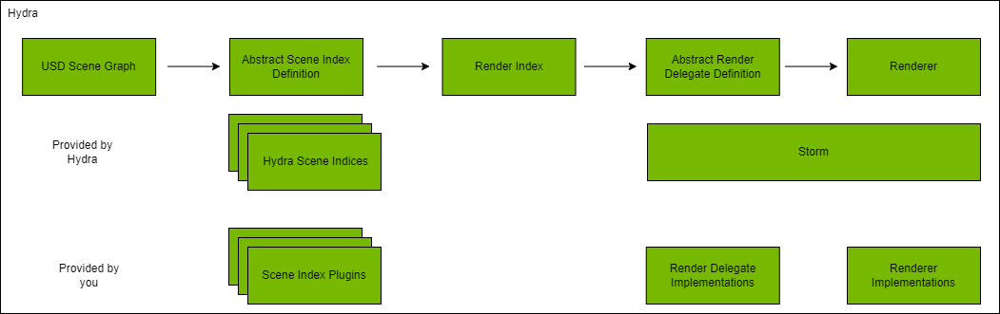
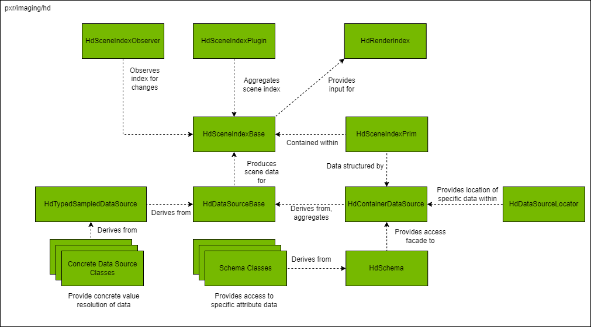
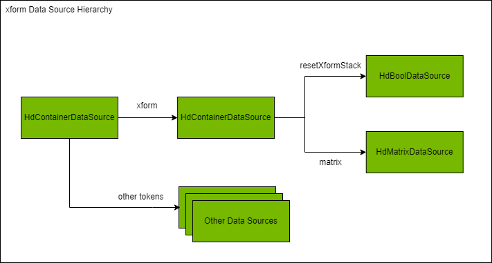
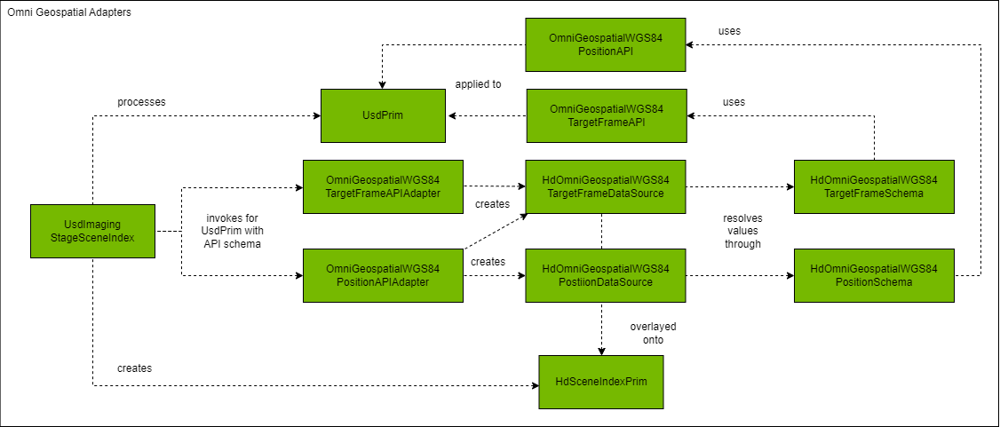
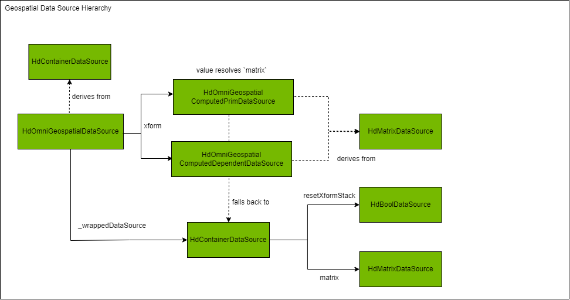
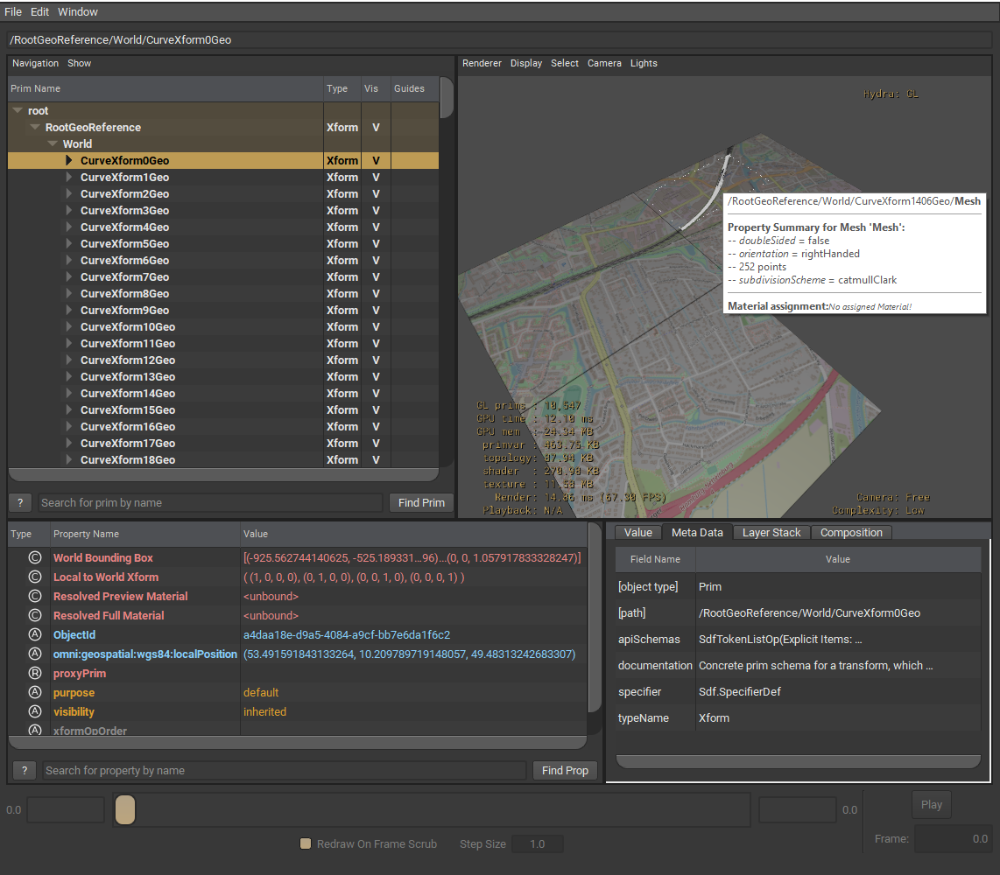
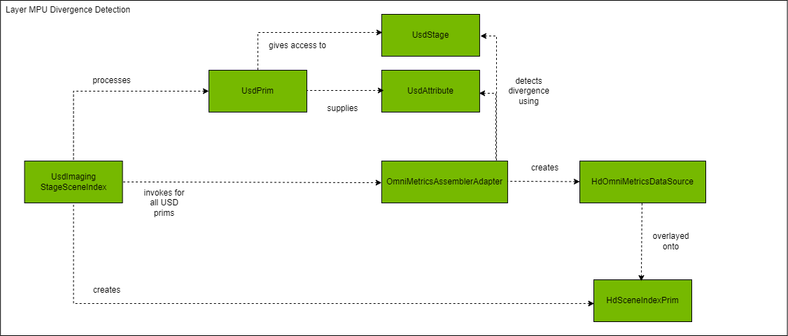

# Runtime Computation in Hydra 2.0

Hydra 2.0 is the evolution of the data pipeline that consumes, transforms, flattens, or otherwise manipulates content authored on `UsdPrim` instances and prepares it for consumption by the rendering pipeline and other downstream run-time components that depend on querying data from the authored scene to do their work.  Abstractly, data flows from a stage through one or more _scene indices_ to ultimately end up in the _render index_ where it is consumed by a renderer plug-in to display the content of the authored stage.



A _scene index_ is responsible for managing a view of a subset of data in the stage and transforming that data into consumeable pieces by a downstream component (typically a renderer via the render index).  Because data can be transformed, manipulated, or structured differently along its journey from USD prim to Hydra prim, the pipeline serves as a perfect place to perform dynamic value resolution - on the fly computations that feed correct data into downstream components without the need to explicitly represent that information in the same way in a USD prim.

This repository contains samples that demonstrate the use of Hydra 2.0 to perform runtime computations that feed downstream components without modifying the upstream scene description.  These examples include:

- Geospatial Positioning: Geospatial information is a good example of the type of data that benefits from this dynamic value resolution.  Authored data on a USD prim might contain geospatial location information, but keeping this in sync with the USD transform stack is burdensome.  We don't want to change the inherent representation and behavior of `Xformable` objects, but we do ultimately need the geospatial information to contribute to the final transform of a prim where required.
- Metrics Assembly: Stages composed of assets sourced from different DCC tools may find that their agreements on metrics diverge in opinion.  Hydra 2.0 can be used as a computation pipeline for adding metrics correctives (e.g., scales, rotations, etc.) to ensure all data is defined in the same metric without any additional scene description necessary.
- Warp: Stages can be composed of assets that have a warp computation API schema attached to them, which dictates the source of the warp code used to dynamically compute run-time properties via a warp-specific scene index.  Through this minimal infrastructure, it's possible to add warp-based simulation code to USD objects to investigate scene dynamics.

The remainder of this section gives a brief introduction of Hydra 2.0 and discusses each example in more detail.

# A Brief Introduction to Hydra 2.0 Concepts

Hydra serves as a data flow pipeline taking data from a USD stage, potentially manipulating that data in some way more suitable for downstream components, and providing a way to get at that information for things like the render index.  In order to better understand how the geospatial dynamic value resolution is structured, it's worth spending a few words on some basic Hydra 2.0 concepts.

The diagram below depicts the major objects at play in the Hydra 2.0 subsystem and their relationship.



### Hydra Prims

A _Hydra prim_ is the Hydra representation of a USD prim at a given `SdfPath`.  It defines the object that holds attribute values meaningful for the Hydra subsystem and consists of a `primType` and a `dataSource`, the former referring to the type of the prim (i.e. the typed schema of the prim) and the latter referring to the Hydra datasource containing the attributes (and their values) associated with the prim.  It is a simple structure whose values may be empty, referring to the absence of a defined Hydra prim at a given path.  The layout of a Hydra prim may be very different than that of its USD prim equivalent at a given `SdfPath` - this is primarily due to the different access patterns required by downstream components that Hydra data feeds into.

### Data Sources and Locators

A _data source_ is the means for representing the value of an attribute.  Simple attribute values are generally represented by two types of data sources:

- `HdVectorDataSource`: A data source representing indexed data, where each index into the vector itself represents a data source.
- `HdTypedSampledDataSource`: A data source representing time-sampled values.  In general, these data sources can also represented _uniform_ data by using a `shutterOffset` of `0.0f` (i.e., similar to access using `UsdTimeCode::Default()`).  This is a templated data source that can be used to represent values of different types (e.g., numeric, boolean, string, dimensional vectors, matrices, locators, enums, resolver contexts, etc. - standard typedefs for some of these are given in `dataSourceTypeDefs.h`).

Both of the above base data sources are abstract, meaning you need to derive from these to provide concrete implementations for retrieving values.  In many cases, the backing source for the data retrieved is the authored data on a `UsdPrim`, but this is not a requirement; data sources can effectively be backed by any type of data store.  For example, `UsdImaging` has an implementation deriving from `HdMatrixDataSource` that is backed by a `UsdGeomXformable::XformQuery` object, which allows it to query transform information on an `Xformable` type `UsdPrim`.

A _container data source_ is capable of representing structured data.  It does this by mapping a token to a data source; that is, the container is indexed by providing a token and getting back the data source associated with that token via the `Get` method of the data source.  A list of tokens supported by the container data source can be retrieved via the `GetNames` method.  The container data source is a powerful structuring mechanism that can support hiearchies of data by nesting container data sources together.  An example of how flattened transform data is represented in Hydra is given in the diagram below:



Additional types of data sources provided by Hydra allow for different structuring of data.  For example, `HdOverlayContainerDataSource` provides a lazy composition of multiple container sources where earlier entries of the containers have stronger opinion strength when the token name provide to `Get` is shared amongst the array of container data sources being overlaid.  An since the overlay container data source is also a container data source, you can have multiple nestings of overlays in a hierarchy.  Another example is `HdRetainedContainerDataSource`, which is a container data source that has cached data available locally, useful for retrieving data not backed by live data sources.

All data sources are worked with via _handles_ which are `shared_ptr` instances referring to the allocated data source.  These are available by using the `HD_DECLARE_DATASOURCE` and `HD_DECLARE_DATASOURCE_HANDLES` macros.  Similarly, using these macros generates a static `New` method that allocates memory for the data source type.

A _data source locator_ represents an object that can identify the location of a data source; they represent one or more tokens that taken together can find a given data source.  When used in conjunction with a container data source, the list of tokens making up the locator represent the hierarchy traversal of the container to retrieve a specific data source.  For example, in the case of the container data source representing `xform` data described above, we can retrieve the `matrix` data source by using a list of tokens (`xform` and `matrix`) as part of a data source locator to directly get the `matrix` data source from a container data source aggregating `xform` data with e.g., `mesh` data:

```
const HdDataSourceLocator matrixLocator {
    HdXformSchemaTokens->xform,
    HdXformSchemaTokens->matrix
}

HdMatrixDataSourceHandle matrixDataSource = HdMatrixDataSource::Cast(
    HdContainerDataSource::Get(aggregatingContainerDataSource, matrixLocator));
```

This is a convenient way of traversing the container data hierarchy when a specific attribute value is required.  Data source locators can be combined into locator sets, and these sets can be unioned and interescted, which is often useful in operations like e.g., detecting if a particular set of locators are in a dirty locator set.

### Hydra Schemas

A _schema_ in Hydra represents a view of a specific set of data within a container data source and provides wrapper methods to obtain the data sources and their resolved values in an easy way.  Everything you can do with a schema can be done via the raw data source APIs, but Hydra schemas make this easier by encapsulating much of the boilerplate code to retrieve resolved attribute values into strongly typed methods.  They typically provide a way to obtain the data sources for each attribute token that they are responsible for on the backing container data source and have a way to build retained data sources from the backing content.

A Hydra schema does not have to follow the same structure as a USD schema.  In fact, the flattened transform hierarchy represented by `HdXformSchema` is very different than the ordered `xformOp` based structure of its USD schema equivalent.  In the Pixar source, a code generator is used to construct these, but that generator is not shipped with the Pixar source.  However, they are fairly straightforward to put together manually for a limited number of supported attribute name tokens.

Schemas can also provide a default locator, which allows users to query the data source associated with the container that represents the container data source the schema is concerned with.  For example, the default locator for the `HdXformSchema` is `xform`, which allows the user to retrieve the container data source from the parent that the `HdXformSchema` can use to retrieve the data sources associated with the attributes it is responsible for (e.g., `resetXformStack`, `matrix`).

The following example shows the difference between obtaining raw data from a container data source or using the schema to do the same thing:

```
HdContainerDataSourceHandle xformDataSource = aggregatingContainerDataSource->Get(HdXformSchemaTokens->xform);
if (xformDataSource != nullptr)
{
    HdMatrixDataSourceHandle matrixDataSource = xformDataSource->Get(HdXFormSchemaTokens->matrix);
    if (matrixDataSource != nullptr)
    {
        GfMatrix4d matrix = matrixDataSource->GetTypedValue(0.0f);
    }
}


HdXformSchema xformSchema = HdXformSchema::GetFromParent(aggregatingContainerDataSource);
if (xformSchema.IsDefined())
{
    GfMatrix4d matrix = xformSchema.GetMatrix().GetTypedValue(0.0f);
}
```

Note that the second snippet (which uses the schema) is a good way for checking whether a container data source has all of the attributes expected by the `HdXformSchema`.

### Scene Indices

A _scene index_ provides an interface for storing, querying, or observing changes to scene data.  All scene indices ultimately derive from `HdSceneIndexBase`, the base interface that exposes the abstract scene data API and scene observer API.  This interface allows any scene index to implement these methods for the prims that they are interested in and delegate all other queries to the next scene index in the chain.  To do this in practice, most scene indices will derive from `HdSingleInputFilteringSceneIndexBase`, which provides a way to chain calls to the next scene index via the `_GetInputSceneIndex`.  In this way a scene index only has to deal with the specific data it is interested in and delegate the remaining queries to its input scene index.

Scene indices have the opportunity to process Hydra prims when they are added and removed from a scene as well as when they are dirtied.  During this processing, they have the opportunity to create / update any data sources associated with the hydra prims that they are interested in and potentially manage their own dependency management to propagate new add / remove / dirty Hydra prim requests to the scene index chain.

Hydra supports the concept of _scene index plugins_.  These are scene index components composed into the application's scene index stack in such a way that they can query the data they are interested in from the scene and work with that subset of data in some way.   Scene index plugins are structured as standard USD plugins and must do the following:

- Derive from `HdSceneIndexPlugin`
- Register their type via a `TF_REGISTRY_FUNCTION`
- Register the scene index via a `TF_REGISTRY_FUNCTION`
- Implement the `_AppendSceneIndex` method to create the appropriate scene index object it manages (i.e., something that derives either directly or indirectly from `HdSceneIndexBase`)
- Add the approriate information to their `plugInfo.json` file describing a priority (how soon it should get loaded in the sequence) and a renderer they should load with (or an empty token for all)

In this way, scene index plugins can be used specifically when certain renderers are active and not loaded otherwise.  As of the time of this writing, you aren't given a lot of control over when your scene index plugin is loaded relative to others with the same priority or what specific scene index graph you'd like to ultimately create.  With `usdview` your plugins are always loaded after the standard stack that `UsdImagingGLEngine` brings in.

For `usdview`, the `UsdImagingGLEngine` provides a standard stack of scene indices that manage the Hydra scene (bottom to top):

- `UsdImagingStageSceneIndex`: Responsible for pulling USD prims from a USD stage.
- `UsdImagingPiPrototypePropagatingSceneIndex`: Responsible for translating USD point instancers into Hydra instancers.
- `UsdImagingNiPrototypePropagatingSceneIndex`: Responsible for preparing prims in a USD prototype to be instance by an instancer.
- `UsdImagingSelectionSceneIndex`: Responsible for populating a selection data source mapping selected paths to a corresponding Hydra prim.
- `UsdImagingRenderSettingsFlatteningSceneIndex`: Responsible for adding a flattened render settings representation for downstream consumption.
- `HdFlatteningSceneIndex`: Responsible for observing an input scene index and producing a comparable scene in which inherited state is flattened at leaf prims.
- `UsdImagingDraModeSceneIndex`: Responsible for replacing geometry based on draw mode.

Applications outside of `usdview` can create whatever scene index stack they need to manage their scene.  When working with `usdview`, currently scene index plugins are the only way to insert new scene indices into the aforementioned stack.  This comes with some limitations, some of which are described below in the geospatial proof of concept.

# Creating a Custom Hydra 2.0 Scene Index for Geospatially Aware Transforms

This proof of concept is responsible for two primary activites:

- Creating hydra prim equivalent properties for geospatial data applied to USD prims via the omni geospatial applied API schemas
- Dynamic value resolution of transform values when hydra prims are requested from the scene index

Each of these is discussed in the sections below.

## Populating Hydra Prim Properties for Geospatial Data

In the current incarnation of the omni geospatial schema, there are two important applied API schemas that can be applied to USD prims in the scene:

- `OmniGeospatialWGS84TargetFrameAPI`: Can be applied to one prim on the composed stage and represents a geodetic reference position from which all prims with the `OmniGeospatialWGS84PositionAPI` are defined relative to.  The geodetic reference position is defined via a (longitude, latitude, height) triple,an orientation (which is not taken into account in this proof of concept), and a target frame indicating the reference frame in which the position is defined (currently only `ENU` is supported).
- `OmniGeospatialWGS84PositionAPI`: Can be applied to any `Xformable` prim and defines a (longitude, latitude, height) triple referencing a position relative to the ancestor geodetic reference position (i.e. the ancestor prim that has the `OmniGeospatialWGS84TargetFrameAPI` applied API schema attached).

Since dynamic transform value resolution needs this information to compute the geospatial transform, this information must be populated on the hydra prim equivalent of the USD prim (NOTE: it is not necessary that there is a 1:1 correspondence between Hydra prim and USD prim, nor a 1:1 correspondence in the prim's attributes.  Hydra's primary reponsibility is in processing `Imageable` prims, and in many cases attributes that are present on a single USD prim are converted to a set of different datasoruces for the object rather than one datasource holding all of the information).  As described above, the component responsible for this process in Hydra 2.0 is known as an _adapter_ - in this case, a specific type of adapter known as an _API adapter_.  Two adapters have been added to this proof of concept:

- `OmniGeospatialWGS84TargetFrameAPIAdapter`: Adapts USD prim data with the `OmniGeosptialWGS84TargetFrameAPI` applied schema attached to it to a Hydra data source.
- `OmniGeospatialWGS84PositionAPIAdapter`: Adapts USD prim data with the `OmniGeospatialWGS84PositionAPI` applied schema attached to it to a Hydra data source.

Both adapters are responsible for creating the appropriate Hydra 2.0 datasource that encapsulates the USD prim and uses the omni geospatial schema to acquire attribute values it then exposes as Hydra prim attributes.  This is depicted in the diagram below:



As the Hydra 2.0 `StageSceneIndex` populates (the bottom of the scene index stack in `UsdImaging`), for each USD prim it will look at the list of applied API schemas attached to the prim and call the API adapter registered for each applied API schema type to give them the opportunity to populate Hydra data sources.  In each case, the implemented datasource holds a reference to the underlying `UsdPrim`, and uses the geospatial API schemas to retrieve attribute values from the USD prim.

While the `OmniGeospatialWGS84TargetFrameAPIAdapter` creates a datasource appropriate for the information from the target frame applied API schema (`HdOmniGeospatialWGS84TargetFrameDataSource`), the `OmniGesopatialWGSPositionAPIAdapter` creates two datasources for a Hydra prim - `HdOmniGeospatialWGS84TargetFrameDataSource` and `HdOmniGeospatialWGS84PositionDataSource`.  While it could create only the one it is technically responsible for, by baking in the target frame data source to the Hydra prim we can perform the traversal to find the geodetic root ancestor at population time and not perform that traversal on every computation.  Technically, using this strategy we could eliminate the need for the `OmniGeospatialWGS84TargetFrameAPIAdapter` altogether (since all geodetic reference point information will be baked into each Hydra prim with the geodetic local position attached), but it remains here for completeness.  Note also that the hydra schema for the target frame API also includes stage level information such as `upAxis` and `metersPerUnit`.  This is required to perform the geospatial computations and currently no data source in USD holds this information (including `stageGlobals` which is passed in as an argument to the scene index creation process).  Note this is a highly inefficient way of storing this information because it gets baked into every hydra prim with a position API attached, needlessly repeating the information; future versions will address this inefficiency.

At this point, the Hydra prim at the `SdfPath` representing the USD prim now has two datasources (in addition to others added by other adapters), one representing its local geospatial position and another representing the geodetic reference point on which the local position is based.  However, the transform that will be shipped to the renderer is still incorrect as it's based on Cartesian transform values rather than the attached geospatial information.  In the next step, our custom scene index will be used to create the datasource objects responsible for performing dynamic value resolution on the transform matrix using the information from the datasources added by the adapters in this step.

## Performing Dynamic Value Resolution

A Hydra 2.0 scene index is a great place to perform dynamic value resolution because it can filter out the prims it is interested in and apply datasources that ultimately return the desired values on demand when the attribute is asked for by other components.  In this case, the attribute of interest is the `matrix` attribute; part of the datasource acquired through the use of the locator `xform`.  So far, the scene indices already in Hydra 2.0 have taken care of computing the final transform matrix from the `xformOps` applied to the USD prim.  In addition, all transforms have been flattened by the `HdFlatteningSceneIndex`, a scene index instantiated by `UsdImaging`.  This means that the transforms have already been concatenated from parent to child all the way down the scene hierarchy as this is the format currently expected by the downstream render index (NOTE: this changes with Render Delegate 2.0 later this year).  This is part of the activity taken care of in the base scene index structure added by `UsdImaging`.

To have an opportunity to process the Hydra prims, we need to create a scene index plugin; `OmniGeospatialSceneIndex`.  This allows us the opportunity to override the `GetPrim` method of the base `HdSingleInputFilteringSceneIndex` to decide whether or not we want to take action on the Hydra prim at the queried path.  In our case, we are interested in processing any Hydra prim that has the `xform` datasource attached to it; that is, any Hydra prim that has a `HdXformSchema` hydra schema defined for it.  Recall the way we check for the presence of a datasource on a prim is typically through a hydra schema, so we can query the Hydra prim for that schema and check whether it's really defined or not (i.e. if the schema is defined, the datasource identified via the locator `xform` will be present on the Hydra prim).  If it is defined, we want to wrap the prim by defining a new datasource that encpasulates the original one and returning a new Hydra prim with the wrapped data source attached.

Why do we want to wrap the data source?  Effectively our strategy here is to intercept `xform` locator queries in such a way that the `matrix` attribute of the datasource will return our dynamically resolved value rather than the original flattened Cartesian matrix value.  Note that we don't want to do this in all cases - particularly when the value of `resetXformStack` is `true` we do not wrap the prim (except for if the prim also has the geospatial local position API attached to it, which we consider to override the value of `resetXformStack`).  In addition, to save potential datasource allocations on every call to `GetPrim` for an `Xformable` we cache the wrapped prims locally in the scene index and return that cached value if the Hydra prim has already been wrapped.  This does introduce a complication, because now we have to track when the original `xform` locator is dirtied so that we can dirty our own datasource.  More on that below.

Wrapping a Hydra prim consists of the following steps:

- Create a new geospatial data source that has all of the information necessary to perform the value resolution.  This information includes the original data source attached to the Hydra prim.
- Create a new Hydra prim with the same prim type that contains the new geospatial data source

By doing this, we've effectively hijacked any query coming in for the `xform` locator and routed it to our datasource, which can choose whether to dynamically resolve the value or dispatch the query back to the original wrapped datasource.  The specific datasource structure used to perform this wrapping is given in the diagram below:



Note that two sub-datasources are used to perform the value resolve:

- `HdOmniGeospatialComputedPrimDataSource`: Datasource attached to Hydra prims that have the geospatial position applied.  This datasource will use the geospatial reference information to transform the local position in the target frame space into Cartesian space such the the resulting transform is now in the right space.  Note that we only do this for the `translation` portion - the `scale` and `orientation` of the original flattened matrix is preserved such that we preserve desired local orientation and scale.
- `HdOmniGeospatialComputedDependendentDataSource`: Datasource attached to any Hydra prim with `Xformable` information (that doesn't have `resetXformStack` enabled) and that does not have any geospatial information attached to it.  This is required because the Hydra prim may be the child of a Hydra prim that _does_ have geospatial information attached to it, and thus its own transform needs to be corrected based on the new Cartesian value of its geospatial ancestor.

The root datasource (`HdOmniGeospatialDataSource`) is responsible for the dynamic dispatch and caching of the two above datasources depending on the kind of Hydra prim it is attached to.

Unfortunately, our scene index plugin is loaded on top of the base scene index structure, meanining that at the point we can filter out a Hydra prim and decide what we want to do with it, it has already had its transform information flattened.  Future iterations may allow custom scene indices to plugin prior to flattening, but for now our scene index has to work with a flattened view of the transform matrix.  This creates a particular complication when dealing with the children of geospatial prims that need their Cartesian transform corrected based on the new value of its parent, because all transforms have been flattened.  Thus, we must recover the original local Cartesian transform of the dependent prim in question, then apply the concatenation of the new parent transform with its own local transform.  To recover the original local transform, we leverage the fact that the current flattened transform would have been computed as `FT = (P)(LT)` where `FT` is the current flattened transform, `P` is the original flattened transform of the parent prim, and `LT` is the local transform of the child.  By knowing what the original flattened transform of the parent was (prior to us dynamically resolving a new value), we can recover `LT` via `LT = (FT) * (P)^-1`.  That is, by computing the inverse transform of the original flattened transform of the parent and multiplying it by the current flattened transform of the child, we recover the original local transform of the child.  Once this value is known, we can multiply it with the dynamically resolved flattened transform of the parent to obtain the corrected flattened transform of the child.

These dynamically computed values are the ones returned when any downstream component requests the `xform` datasource on a wrapped Hydra prim.  Note that for any value requested that is not the one we are intercepting in the wrapping datasource, the request is forwarded to the original datasource that was wrapped.  This allows us to preserve queries flowing through Hydra prim data sources in much the same way the `GetPrim` call operates at the scene index level (i.e. dispatching the call to the input scene index if it isn't something the scene index wants to handle).

Note that at least in the case of computed dependent prims, it is important that we retain access to the original flattened transform.  Since this value is the one that is stored in the datasource we wrapped, we only have to create a locator (in this case `geospatialPreservedXform`) that forwards the request to the wrapped data source's `xform` locator.

You can verify that the information attached to the Hydra prim is accurate using the scene index browser of `usdview`.  Here you can inspect the Hydra prims in the scene, look at their datasources and verify the values for their attributes.




In the scene browser, you can see that for the `CurveXform1Geo` prim, which has had the `OmniGeospatialWGS84PositionAPI` applied API schema attached to it, that our geospatial scene index has added container data sources for `positionApi`, `targetFrameApi`, and `geospatialPreservedXform`.  Additionally, the value shown in the `matrix` attribute of the `xform` container data source displays a dynamically resolved value that incorporates the geodetic local position from the geodetic reference point.

## Dirtying and Dependencies

While this proof of concept does not contain a full implementation of dependency handling when an attribute is dirtied, it is important to understand how dirtying of Hydra prim datasources occurs (NOTE: the implementation contained within this proof of concept has not been verified as `usdview` does not allow us to change attribute values).

During population of the Hydra scene, and subsequently when new prims are added to the scene, all scene indices registered with Hydra will receive a call to `_PrimsAdded`.  Each of these calls contains a list of prims added and gives your scene index a chance to process these prims.  In our case, this is where we wrap the Hydra prim if required (we also do similar logic on `GetPrim` - performance tradeoffs would need to be investigated between wrapping all prims initially, which occurs now via `_PrimsAdded`, or wrapping them on demand when they are requested in `GetPrim` - the current logic does it in both methods, but only if the Hydra prim has not been wrapped before).  If a Hydra prim was inserted into the existing hierarchy, we may need to invalidate descendant prims.  That is, if a Hydra prim was inserted and it has the `HdXformSchema`, we need to invalidate the data sources of the child prims (upon which they will invalidate their cached datasources and update with new ones).  This is necessary because as part of the wrapped datasource infastructure we are caching the value resolving datasources that depend on the input data source we wrapped, which may have changed.

Similarly, when a Hydra prim is dirtied, we need to check whether the `xform` locator was included in the dirty set.  If so, we need to invalidate all wrapped datasources in the hieararchy and make sure we update the input data source such that we have the correct datasource for the `xform` locator on the wrapped prim.  Finally, when a Hydra prim is removed, we can remove the wrappers for it and its children.  In all cases, we need to ensure we send the added / changed / removed prims along the scene hierarchy using the `_SendPrimsAdded` / `_SendPrimsDirtied` / `_SendPrimsRemoved` methods of the base scene index.  And if any prims are dirtied via the add process (e.g. an insertion), we need to include those in a dirty list we also forward along to the base scene index.

While we could rely on the `HdDependencyForwardingSceneIndex` to take care of updating the right dependencies by creating `HdDependencyDataSource` objects, it is simpler in this case to manage the dependency dirtying directly without the intermediate datasources added with the `__dependencies` locator.  Future work will include proper handling of locator dirtying, particularly taking into account the geospatial information, which is currently not considered at this time.

# Performing MPU Metrics Assembly in a Hydra 2.0 Scene Index

This proof of concept demonstrates a Hydra 2.0 based method of dealing with layers that have divergent metrics.  Specifically, layers that diverge in their opinion about `metersPerUnit` when composing stages that come from multiple disparate source DCCs that have certain assumptions about their default unit.  OpenUSD takes the stance that it is the responsibility of the user constructing the stage to make sure everything is in the right units, but this is difficult to do when taking data that may have been converted from different source DCC tools in an ecosystem not entirely under the user's control.  While pre-processing scripts can certainly be applied to correct the units once and for all, this approach is not feasible if the asset is being composed into multiple different stages, each of which themselves may have disparate `metersPerUnit` assumptions.

Hand authoring correctives is possible, but tedious.  Existing approaches that attempt to automate this correction do so by adding explicit additional `xformOp` instances to a `UsdPrim`, which get serialized with the layer and remain when transporting the stage across the ecosystem.  This proof of concept takes the approach of dynamically resolving the value by applying a corrective in the Hydra 2.0 pipeline, rather than via additional data applied to the `UsdPrim`.  This has the potential advantage of everything being in the correct units for a downstream consumer (e.g., renderer) while not storing additional attributes on the source `UsdPrim`, effectively retaining the true authored intent and allowing layers to be composed in many different ways while being resolved at run-time (including correcting `subLayers`).

This proof of concept demonstrates that metrics assembly can be done at run-time in a Hydra 2.0 scene index by dynamically computing a scale corrective for all prims of type `UsdGeomSphere` in the scene.  While a more general architecture that handles multiple typed and applied API schemas would have to be constructed for a fully functioning metrics assembler, this proof of concept deomonstrates that it is in fact possible this corrective at run-time via a scene index plug-in.

In this proof of concept, we demonstrate that it is possible to detect a layer MPU divergence via the composition engine and dynamically resolve that divergence by applying a corrective scaling transformation via a custom data source applied via a custom scene index.  This proof of concept is not intended to:

- Present a fully architected solution for arbitrary attributes and correctives
- Make any kind of statement about which attributes of which prim types need to be considered for divergence detection and correctives applied by the metrcis assembler

It does, however, demonstrate that the composition system can be used to retrieve the layer with the strongest opinion through examination of a single prim attribute (in this case, `radius`) as a basis for detecting divergence in the `metersPerUnit` attribute of the layer and the use of a custom scene index to apply a custom data source to the hydra prim to value resolve the scale transform.

This can be divided into two phases:

- Layer MPU divergence detection
- Dynamic corrective computation of the local scale transform by the metrics assembler

Each of these is discussed in the sections below.

## Layer MPU Divergence Detection

In order to detect if the `metersPerUnit` of a layer diverges from that of the stage, two pieces of information are required:

- The `metersPerUnit` value for the stage
- The `metersPerUnit` value for the layer with the strongest opinion on the attribute in question

The second point is important, and necessitates knowing which attribute (or set of attributes) needs to be checked in order to conclude whether a divergence occurred or not.  This is because different prim attributes can compose differently depending on which layers those attribute values have been authored in.  Furthermore, this is not a one-time check - changes in composition (e.g., selection of a new variant, etc.) can result in different answers as to whether divergence has occurred based on the layer containing the new strongest opinion.  This involves the following components:



Fortunately, the composition system makes it trivial to find in which layer the strongest opinion of a property value resides.  Knowing the attribute in question, the `UsdProperty` instance for that attribute can be retrieved from the prim.  From there, a call to `GetPropertyStack` will retrieve a list of `SdfPropertySpec` handles in order from strongest to weakest opinion.  From the property spec, the layer can be retrieved, and the `metersPerUnit` value is available as part of the layer metadata.

It's worth noting that the documentation for `GetPropertyStack` explicitly calls out the results of the method are meant for debugging and diagnostic purposes, primarily because OpenUSD does not want you to retrain references to the property stack for cached value resolution of properties (especially since the attribute values could be time-varying).  However, because we do not retain a reference to the property specs and only use it for a one-time evaluation at the default time code, we believe it's usage satisfies the spirit of the documentation.

As a brief aside, we take the approach in this proof of concept that if the `metersPerUnit` value is not explicitly authored, the default will be centimeters as specified in the OpenUSD documentation here: https://openusd.org/release/api/group___usd_geom_linear_units__group.html.  However, the documentation is explicit in stating this is true for a `UsdStage`, and doesn't necessarily make the distinction across multiple layers composed into the stage.  We argue that an equally valid interpretation of this statement could result in a layer's `metersPerUnit` value to default to that of the stage it is composed in if not explicitly authored.

Once both MPU values are known, we define divergence to be `false` if they are equal to each other (within a tolerance) and `true` otherwise.  If a divergence is detected, this information is recorded on the hydra prim via a custom data source that exposes both the stage MPU and layer MPU for reading later by the metrics assembler component.  Note that if more than one attribute of a prim needs divergent detection, this data source could record an array of divergences for each attribute as required.  We leave this as future work for the reader.

Divergence detection is done when populating the root scene index (the `UsdImagingStageSceneIndex` instance).  It is at this time that Hydra adapters have access to the `UsdPrim` associated with the `SdfPath` in question and can reason about the attributes in question depending on the typed and / or applied schemas associated with the `UsdPrim` instance.  Rather than writing a single adapter per API schema or type (and to prevent having to modify the adapters for the built-in USD types), we leverage the use of a Hydra *null adapter* - this is an adapter that is called to evaluate every prim in the `UsdStage` as the path is traversed root to leaf.

Note that a more general solution would probably revolve around plug-ins responsible for processing the attributes of the prim they are responsible for.  The results of this computation would then be combined in a single data source that can be attached to the hydra prim.  Furthermore, a more general solution should consider other potential divergent metrics, such as `upAxis` or `kilogramsPerUnit`.

## Metrics Assembly Using the Local Scale Transform

Once MPU divergence has been detected and the hydra prim annotated with the appropriate information, there are two cases that the metrics assembler system needs to consider:

- The hydra prim was annotated with divergence information: In this case, this is the prim that needs to have a corrective applied.
- The hydra prim was not annotated with divergence information:  In this case, it does not need a corrective applied directly, but it's own transform may be affected by a parent that was corrected.  This is only a problem because the scene index is inserted after flattening, and so a new flattened matrix has to be computed for the prim based on the corrected flattened matrix of its parent.  In practice, this is not a problem for geometry primitives that typically occupy the leaves of the scene hiearchy, since by convention they do not have geometry prim parents.  In the more general case, especially with regard to applied API schemas, we cannot guarantee this on the scene hierarchy in general.

The `HdFlatteningSceneIndex` is one of the base scene indices added by `UsdImaging` and is responsible for creating a flattened view of some attributes (e.g., transform, visibility, etc.) to satisfy how the current version of a render delegate expects data to be delivered.  As a plugin, we currently only have the opportunity to add a scene index to the chain after flattening, and so we must deal with some challenges introduced by the `xformOp` attributes being flattened into a single transform matrix.  First, we don't have direct access to the local transformation of a hydra prim; we have to recompute the local transform when necessary from the inverse of the parent.  Second, because the flattened matrix already represents the concatenation of the parent flattened matrix with the child's local transform, we must account for direct changes to the transform of a hydra prim (e.g., the one we apply the MPU corrective to) in all of its children.

To apply the corrective, we need to be able to intercept the ask for the data source for token `HdXformSchema->xform`.  The existing data source comptued by the flattening scene index will serve up the flattened transform, but we need to serve up a corrected flattened transform.  This means that whenever a consumer asks the scene index chain for the `HdXformSchema->xform` data source, they should receive our data source rather than the one created by the flattening scene index.  However, we don't want to lose the original flattened matrix because 1) we need it to compute the original local transform of a hydra prim and 2) we may defer back to it when we don't need to perform any computation (e.g., we don't have metrics information attached to a prim and we have no parent in the chain that has it either, implying no corrective would have been applied).  Therefore, we take the same strategy we took when dealing with geospatial transforms - wrap the original data source in a new data source that either computes a corrected transform or defers to the wrapped data source where appropriate.

Our wrapped data source in this case is `HdOmniMetricsDataSource` and serves as the data source when the `HdOmniMetricsSceneIndex` is asked for the `HdXformSchemaTokens->xform` token.  This is a container data source that handles two tokens explicitly and forwards the remaining tokens to the wrapped data source:

- `HdXformSchemaTokens->xform`
- `HdOmniMetricsDataSourceTokens->metricsPreservedXform`

All other tokens (such as `HdXformSchema->resetXformStack`) are deferred to the wrapped data source to retrieve whatever data source it has for that token (or allows it to defer the ask to another data source).

`HdOmniMetricsDataSource` introduces the `metricsPreservedXform` token, which allows components that query the scene index chain to always retrieve the original `HdXformSchemaTokens->xform` data source from the underlying wrapped data source.  This is necessary such that the original uncorrected matrix can be used to recover the local transform matrix of a child prim.  That is, let FT be the flattened child transform, P be the flattened transform of the parent, and LT be the child's local transform (which is our unknown).  FT would have been computed by the flattening scene index as FT = (P)(LT), but P would be the original flattened transform, not the corrected one.  As such, we need access to the original flattened transform to compute LT.  Solving for LT, LT = (FT) / (P) = (FT) * (P)^-1, we find that using the inverse of the original parent flattened transform we can recover the local transform of the child.  Once we have the local transform, computing a new flattened transform can be accomplished by concatenating the new flattened parent with the local transform of the child (recursively as needed down the hierarchy).  This data source structure is very similar to the one for geospatial above.

By intercepting the `HdXformSchemaTokens->xform` token, our data source has the opportunity to compute a new `HdXformSchemaTokens->matrix` data source (and pass through `HdXformSchemaTokens->resetXformStack`) based on whether or not the hydra prim had metrics information attached (or a parent in the chain had metrics information attached).  If metrics information were attached, the local transform of the hydra prim is recovered, a new scaling `xformOp` is applied, and the resulting flattened transform computed and returned as part of the `HdXformSchemaTokens->xform` data source.  This scale is always applied on top of the other operations, as those other operations are already flattened.  If no metrics information is attached, and a parent in the chain did have metrics information attached, a new flattened transform for the hydra prim is computed by recovering the local transform and concatenating that with the new parent flattened transform.

Seeking for a parent hydra prim in the parent hierarchy is trivial (does the hydra prim in question have the `HdOmniMetricsSchema` applied to it?), but a special case does need handling - that of the `SdfPath::AbsoluteRootPath()`.  The flattening scene index does apply an identity matrix to this hydra prim, but when we are handling the case where a component is asking for the hydra prim at path `\` we must take care not to traverse the parent chain, because we are already at the root of the scene hierarchy.

Note that we do not do any special handling for `resetXformStack`.  Although the corrective is always applied on the transform of the sphere prim itself (with the semantics that this is still the local transform of the prim) a check should be made if the flag is `true` so that the parent matrix isn't reapplied to flatten the corrected flattened transform matrix of the prim.

### Caveats, Restrictions, and Assumptions

A major caveat to any runtime computation approach in Hydra 2.0 is that tools such as `usdview` make heavy use of `UsdGeomBBoxCache`, which is a USD side cache of the extents of a prim.  Similarly, xform caches are prevalent throughout the code.  Unfortunately, any runtime computation done in a Hydra 2.0 data source will not be propagated to any of these caches.  In practice, this means that visualization of the bounding box of a prim in tools like `usdview` will be incorrect with regard to the final computed value observed (e.g., like the scale of an object, in this case).  This necessitates the question of whether these caches need to reside in the hydra pipeline vs. the USD pipeline, with their own advantages and drawbacks.

It may also be the case that runtime computation of the final value could depend entirely on the position of the scene index in question in the overall scene index chain.  If order of operations matter for final computation, and multiple scene indices in the chain are resolving the same attribute for different use cases, the order in which the scene indices are chained together could matter, and it would be up to the user to be able to configure their scene indices appropriately in the plugin metadata.

This proof of concept is only looking at a single well-known attribute value on a well-known prim type in the scene (i.e. `radius` on `UsdGeom` prim types).  While this is fine to prove that MPU divergence can be detected, a more general solution is required to be able to resolve metrics values in general.  The solution must be architected in a way that:

- Is extensible for all schemas applied to a prim (both typed and applied API schemas)
- Is extensible enough to perform user-defined corrective computation where required (i.e., not all divergences require the same kind of resolution, and not all resolutions can be easily described via configuration, necessitating some form of runtime treatment).
- Considers other metric divergences such as `upAxis`, `kilogramsPerUnit`, etc. as they are introduced into layer metadata
- Takes *blocked* attribute values into account

Finally, this proof of concept made some assumptions that require further discussion:

- The default for a layer with no authored `metersPerUnit` value is centimeters (and not the value of the stage layer)
- Scaling is done at the leaf node (in this case, for `UsdGeomSphere` types) and it is a direct conversion to the stage MPU (and not a layer by layer conversion if there are multiple entities to resolve with different MPU in the layer stack)
- The author had not inserted scale correctives of their own.  A dynamic resolution system that resolves metric divergences can never know whether a hand corrected scale was authored in the layer stack.  The best that could be done would be to agree on some sort of naming convention for the corrective and, if present as a independent `xformOp` attribute in the strongest opinion, would cause the Hydra layer to not perform a second corrective when it resolved the value
- What should happen in the case where multiple attributes are considered?  Take a `UsdGeomPlane` for example, with `width` and `height` attributes - this proof of concept would reconcile each of these attributes differently via a (potentially) non-uniform scale determined by different layer target sites for the strongest opinions of these properties.  This case also illustrates that some correctives are not straightforward, and in this case, may rely on other attributes (`axis`) that aren't directly affected by the corrective; this makes it difficult to rely solely on a declarative system for resolution.
- Correctives were only applied to scale.  Other correctives might be necessary in other instances, i.e., layer divergence in `upAxis` which would require a rotation corrective.
