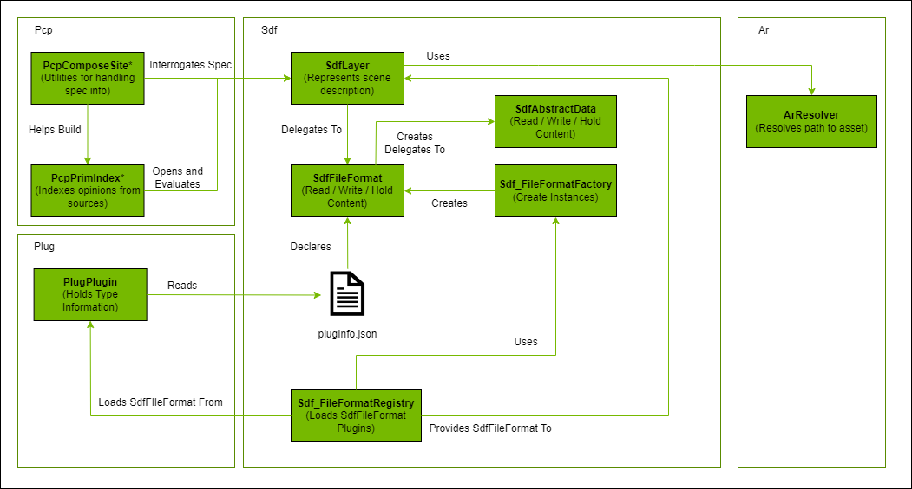
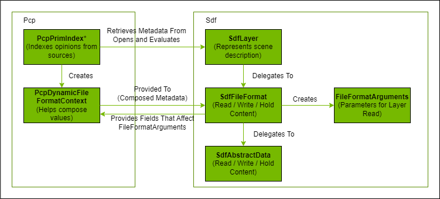
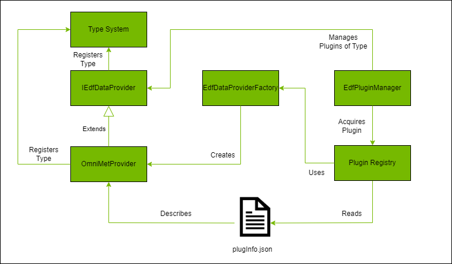

# Schemas, File Format Plugins, and Dynamic Payloads

## USD Schemas

Recall that USD defines the concept of a "prim".  Prims abstractly serve as data containers for groups of logically related data.  These groups are referred to as _schemas_ (or more specificaly, _prim schemas_ to distinguish them from _property schemas_).  When we say that a prim has a type of _Mesh_, what we really mean is that the prim provides the logical set of related data defined by the `UsdGeomMesh` schema (e.g., vertices, faces, normals, etc.).

Schemas are divided into two major categories _IsA_ schemas and _API_ schemas.  _IsA_ schemas are meant to define a specific purpose for a prim.  In the case above, a _Mesh_ prim is a prim who's specific purpose is to represent a mesh.  A prim can only subscribe to a single _IsA_ schema - that is, it has a single well defined role in the scene hierarchy.  These types of schemas can be inherited and within that inheritance hierarchy schemas can be either _abstract_ or _concrete_.  Only concrete schemas are instantiable in the USD scene hierarchy.

_API Schemas_, on the other hand, serve only as additional data groups on prims as well as a well-defined API to get and set those values.  These schema types can be applied to any prim in the scene hierarchy (as long as the schema rules say it can be applied to that prim type). If a prim has a type, you will see that type in the scene hierarchy.  If a prim has an API schema applied, you won't see a difference in its type, but will still be able to ask that prim for the data contained within that schema.  These types of schemas can be either _non-applied_ or _applied_ API schemas, with the difference being that applied API schemes will be recorded in the USD file such that they retain that information on interchange of the scene data to other applications.  If a schema is an applied API schema, it can be either single instance (_single-apply_ API schemas, applied only once to a prim) or multi-instance (_multiple-apply_ API schemas, can be applied several times, each defining a unique instance).

USD ships with many schema definitions that you may be familiar with, including "IsA" schemas (e.g., `Mesh`, `Xform`) and "API" schemas (e.g., `UsdShadeMaterialBindingAPI`, `UsdCollectionAPI`, etc.).  These can all be found in their respective modules (e.g., the schema set provided by `UsdGeom` can be found in pxr/usd/usdGeom/schema.usda).

More information on schemas can be found here: https://graphics.pixar.com/usd/release/tut_generating_new_schema.html

### Creating new Schema Extensions and Naming Conventions

Schema extensions are created by defining the schema using USD syntax, typically in a file called `schema.usda`.  Before defining your schema classes, you must determine the name of your schema library.  Since the entire USD community can add schema extensions, it is important to be able to recognize from which organization / application a schema extension originates and to name them uniquely enough such that naming collisions do not occur across applications.  For example, across the NVIDIA organization, we want that our schema extensions are easily recognizeable by the community so it is clear what Omniverse will support and what 3rd party applications may not have support for.  In general, you can expect the following:

- `Omni` is the prefix used for NVIDIA's schema extensions. If `Omni` is not appropriate, other prefixes may be used as long as they are distinct enough to recognize that they came from NVIDIA (e.g., `PhysX`).
- All applied API schemas will end with the `API` suffix (as well as adhering to the prefix rule above)
- All properties added by an API schema will start with a recognizeable namespacing prefix (e.g., `omni`) and be namespaced appropriately (e.g., `omni:graph:attrname`, etc.)
- Properties within an IsA schema may have namespace prefixes if derived from core USD schema types.

The samples provide examples for two types of schemas, codeful and codeless.  The former will have C++ / Python code generated for it, the latter will only have USD plug-in information generated.  These are provided in the `src/usd-plugins/schema/omniExampleSchema` and `src/usd-plugins/schema/omniExampleCodelessSchema` in their respective `schema.usda` files.  

Additionally, there are several schemas used throughout the other samples that are also included here (e.g., `src/usd-plugins/schema/omniMetSchema`, `src/hydra-plugins/omniWarpSceneIndex`).

## File Format Plugins

A _file format plugin_ is the type of USD plugin that is responsible for dynamically translating the contents of a foreign format into `SdfPrimSpec` compatible data.  While files are common, the source data does not have to reside strictly in a file.  

Two objects are provided in the `Sdf` library for implementing file format plugins, `SdfFileFormat` and `SdfAbstractData`.  The former is a base class for defining a new type of file format and the interface used to read / write that format by the USD runtime and the latter is a data adapter that can be used to customize how the data that was read is stored / cached / accessed.  All file format plugins implement `SdfFileFormat`.  File format plugins that need more granular management of the data cache also implement `SdfAbstractData` although this is not necessary - if you do not provide a custom data object the USD runtime will use `SdfData` as the data object associated with the content from your file format for a layer.

From a USD runtime perspective, file format plugins involve the following objects:

When a stage is opened, the root layer is opened and prim specs are formed for all prims.  Each of these are indexed by the composition engine and the index notes if there are additional composition arcs for a prim (e.g., via a reference or payload).  These arcs are resolved by opening the referenced layer.  If the layer is an asset reference to a foreign file format, `Sdf` will look for a plugin responsible for that format and ask an instance of that plugin to load the asset.  This is done by the layer (`SdfLayer`) asking the `Sdf_FileFormatRegistry` to find a plugin associated with a particular extension, which if accessed for the first time triggers an acquisition of all plugins drived from `SdfFileFormat` held by `PlugRegistry` and the loading of the one responsible for the particular extension.  Once found, `SdfLayer` will initialize a `SdfAbstractData` object to associate with the file format (either a custom one provided by the file format or `SdfData` if there is no custom data object) and ask the plugin to read the information into the layer.  For each prim read in the layer, the composition engine will index those prims and recursively resolve any additional composition arcs required to build the full prim index.

File format plugins may also write out content in their native format.  By default, custom file format plugins do not write content and it is up to the implementor to indicate that they support writes and to write the content out appropriately.

Interestingly, file format plugins do not actually have to read from files - they can read from any backing data store as long as they know what data to read and how to interpret it.  From the point of view of the USD runtime, the only requirements are the interface to reading / writing the data and the association of the plugin type to a file extension (which can be made up for non-file types).

This repository provides a sample file format plugin that is used to implement dynamic payload functionality in the `src/fileFormat/edfFileFormat` directory.  The information is read from REST APIs associated with the Metropolitan Museum of Art to illustrate the data need not come from a file at all.  An empty file (`resources/empty.edf`) is provided such that the payload reference can be added to the stage using an existing asset, but the content is not used at all.  We could eliminate the file entirely by referencing an anonymous layer with the `.edf` extension.

Other examples of more traditional file format plugins exist directly in the USD repository; for example, the Alembic (`abc`) file format plugin resides here:

- https://github.com/PixarAnimationStudios/USD/blob/release/pxr/usd/plugin/usdAbc/alembicFileFormat.h

## Dynamic Payloads

_Dynamic payloads_ are file format plugins with additional functionality (that can only be used with the payload composition arc) to make them a bit more dynamic in nature.  These dynamics are provided via a set of parameters in the metadata of the prim that has the payload composition arc to a dynamic payload.  This is a powerful mechanism because:

- The information brought into the layer can be parameterized in ways specific to the data the payload is resposible for
- Those parameters can be modified by tools that allow metadata modification to reload the layer with the new parameter set
- Metadata participates in composition, so the composition engine can form the strongest opinions of the custom prim metadata and use that opinion to compute additional file format arguments that will be added to the asset path (and sent to the file format plugin)

From a USD runtime perspective, dynamic payloads involve the following objects (additionally to those already shown for file format plugins)

To implement a dynamic payload, your file format plugin must provide additional functionality for the USD runtime:

- Must inherit `PcpDynamicFileFormatInterface` in addition to `SdfFileFormat`
- Must be able to compose a set of `FileFormatArguments` from the contents of metadata read from the prim associated with the paylaod

The metadata used must be declared in the `plugInfo.json` file such that `Sdf` knows about it.  It is up to you to determine what format this metadata takes and there is often a balance between generality (for extensiblity) vs. clarity (knowing what exactly can be parameterized).  

The `PcpDynamicFileFormatInterface` provides two important methods that need to be implemented:

- `ComposeFieldsForFileFormatArguments`: This method takes a composition context to acquire the composed metadata and translate this information into a set of `FileFormatArguments` that will be provided to the layer when opening the layer (and eventually, to the `SdfFileFormat` object as arguments to the `Read` invocation)
- `CanFieldChangeAffectFileFormatArguments`: This method allows the file format plugin to inform the composition engine what metadata value changes would contribute to the construction of new file format arguments (and hence, a reload of the layer)

Depending on how the implementation translates the metadata into `FileFormatArguments`, it is possible that there is a 1:1, 1:N, or N:1 mapping of metadata values to `FileFormatArguments` values.  It is up to the implementation to understand whether changes to a particular metadata value would contribute to a recomputation of a `FileFormatArguments` value.  If a change does contribute and new `FileFormatArguments` are generated, the composition engine will trigger a reload of that layer using the new `FileFormatArguments`.  Since the arguments contribute to the layer identifier, this would be considered a new layer from the point of view of the USD runtime.

This repository provides an example of a dynamic payload between two plugins:

- The `EdfFileFormat` object provided in `src/usd-plugins/fileFormat/edfFileFormat`
- The `OmniMetProvider` object provided in `src/usd-plugins/dynamicPayload/omniMetProvider`

This was structured in this way for two reasons:

- To illustrate that one file format could architecturally handle multiple back-ends generically by using its own plugin mechanism for loading back-end providers identified via a type on the metadata
- To illustrate an example of an object that manages its own types of plugins

Architecturally, this breaks down as follows:

Note that the implementation for data provider plugins is modeled exactly after the generic USD plugin architecture.  This pattern allows you to create and manage your own plugins in the same way USD does.  In this case, the file format plugin architecture manages the `EdfFileFormat` plugin itself, and the `EdFFileFormat` takes care of loading whatever provider is specified via the metadata attached to the prim.  In theory, this allows different dynamic payloads on different prims to use different data providers to source data, but uses the same fundamental architecture to manage that data once it comes in.